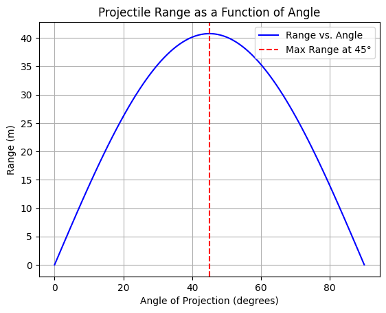

## Problem 1: Investigating the Range as a Function of the Angle of Projection

### 🔷 Motivation:
Projectile motion is a fundamental topic in physics that showcases how forces and motion interact in two dimensions. Understanding how the **range of a projectile** depends on the **angle of projection** is crucial in various real-world applications, such as **sports, engineering, and ballistics**.

This problem investigates the relationship between the **horizontal range (R)** and the **angle of projection (θ)** while considering how different parameters, such as **initial velocity (v₀)** and **gravitational acceleration (g)**, influence the results.

---

## Task:

### Theoretical Foundation:
To analyze projectile motion, we break it into **horizontal** and **vertical** components.

#### **Equations of Motion:**
1. **Horizontal Motion (Constant Velocity):**
   $$
   x = v_0 \cos(\theta) t
   $$
   Since there is no acceleration in the horizontal direction (ignoring air resistance), velocity remains constant.

2. **Vertical Motion (Accelerated Motion):**
   $$
   y = v_0 \sin(\theta) t - \frac{1}{2} g t^2
   $$
   The vertical component is influenced by gravity, leading to parabolic motion.

---

#### **Key Derived Equations**
**Time of Flight (T)**  
The projectile reaches the ground when \( y = 0 \):
   $$
   T = \frac{2 v_0 \sin(\theta)}{g}
   $$

**Horizontal Range (R)**  
Since \( x = v_0 \cos(\theta) t \), substituting \( T \):
   $$
   R = \frac{v_0^2 \sin(2\theta)}{g}
   $$

- **The maximum range** occurs at **\( \theta = 45^\circ \)**.
- **The same range** is achieved for angles **\( \theta \) and \( 90^\circ - \theta \)**.

---

### Analysis of the Range:
- **Symmetry Property**: A projectile launched at **30°** has the same range as one launched at **60°**.
- **Effect of \( v_0 \)**: Higher initial velocity **increases range quadratically**.
- **Effect of Gravity \( g \)**: On planets with higher gravity (e.g., Jupiter), the range is **significantly reduced**.

 **Numerical methods** can be used for cases with air resistance or uneven terrain.

---

### Practical Applications:
Understanding projectile motion is crucial in:
- **Sports**: Calculating the optimal angle to kick a soccer ball or throw a basketball.
- **Engineering**: Designing projectile launchers for defense or space applications.
- **Astrophysics**: Determining planetary lander trajectories and orbital insertions.

---

### Implementation: Python Simulation

#### **Python plot for Visualizing Range vs. Angle**

