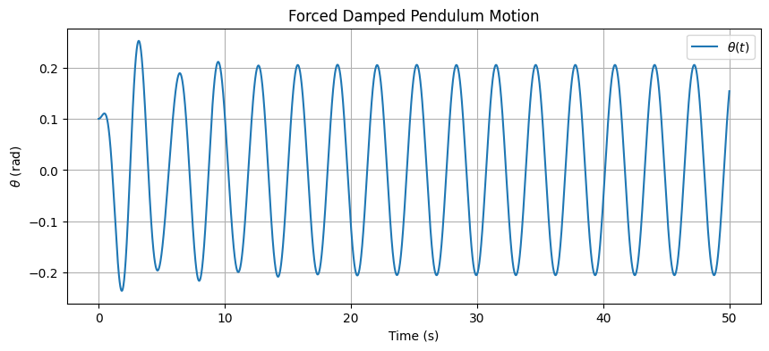
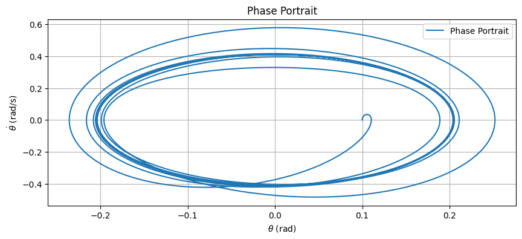
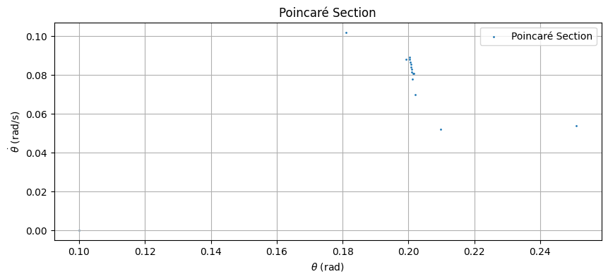

# Problem 2: Forced Damped Pendulum Physics Lab

## Theoretical Foundation

### Differential Equation and Small-Angle Approximation

The motion of a forced damped pendulum is governed by the following differential equation:

$$
\frac{d^2\theta}{dt^2} + b \frac{d\theta}{dt} + \frac{g}{L} \sin\theta = A \cos(\omega t)
$$

Where:

- $\theta$ is the angular displacement,
- $b$ is the damping coefficient,
- $g$ is the acceleration due to gravity ($9.81 \, \text{m/s}^2$),
- $L$ is the length of the pendulum,
- $A$ is the amplitude of the external driving force,
- $\omega$ is the driving frequency,
- $t$ is time.

For small-angle oscillations ($\theta \ll 1$), we can approximate $\sin\theta \approx \theta$, simplifying the equation to a linear form:

$$
\frac{d^2\theta}{dt^2} + b \frac{d\theta}{dt} + \frac{g}{L} \theta = A \cos(\omega t)
$$

This is a second-order linear differential equation with a periodic driving term. The homogeneous solution (without the driving force) is:

$$
\theta_h(t) = e^{-\frac{b}{2}t} \left( C_1 \cos(\omega_0 t) + C_2 \sin(\omega_0 t) \right)
$$

Where $\omega_0 = \sqrt{\frac{g}{L} - \left(\frac{b}{2}\right)^2}$ is the damped natural frequency, and $C_1, C_2$ are constants determined by initial conditions. The particular solution (due to the driving force) takes the form:

$$
\theta_p(t) = B \cos(\omega t) + C \sin(\omega t)
$$

Substituting into the differential equation and solving for $B$ and $C$, we find the steady-state amplitude depends on the driving frequency $\omega$. The total solution is:

$$
\theta(t) = \theta_h(t) + \theta_p(t)
$$

### Resonance Conditions and Energy Implications

Resonance occurs when the driving frequency $\omega$ approaches the natural frequency $\omega_n = \sqrt{\frac{g}{L}}$. The amplitude of oscillation peaks at resonance, and the energy transfer from the driving force to the pendulum is maximized. The resonance frequency shifts slightly due to damping:

$$
\omega_r = \sqrt{\omega_n^2 - \left(\frac{b}{2}\right)^2}
$$

At resonance, the system absorbs energy efficiently, but damping dissipates energy as heat, limiting the amplitude growth. For low damping ($b \to 0$), the amplitude can grow significantly, while high damping suppresses the resonance peak.

## 2. Analysis of Dynamics

### Influence of Parameters

- **Damping Coefficient ($b$)**: Higher damping reduces the amplitude of oscillations and shifts the system toward overdamped behavior ($b^2 > 4\omega_n^2$). Low damping allows sustained oscillations and sharper resonance.
- **Driving Amplitude ($A$)**: Increasing $A$ linearly increases the steady-state amplitude of oscillations.
- **Driving Frequency ($\omega$)**: When $\omega \approx \omega_n$, resonance amplifies the motion. Far from resonance, the pendulum oscillates at the driving frequency with reduced amplitude.

### Transition to Chaotic Motion

For large driving amplitudes or specific frequencies, the system can exhibit chaotic behavior due to the nonlinearity of $\sin\theta$. Chaos arises when the pendulum undergoes period-doubling bifurcations, leading to unpredictable motion. This can be observed in phase portraits (plots of $\theta$ vs. $\frac{d\theta}{dt}$) and Poincaré sections (snapshots of the phase space at intervals of the driving period).

## 3. Practical Applications

The forced damped pendulum model applies to several real-world scenarios:

- **Energy Harvesting Devices**: Piezoelectric devices can use oscillatory motion (similar to a forced pendulum) to convert mechanical vibrations into electrical energy, such as in wearable tech or structural monitoring.
- **Suspension Bridges**: Bridges experience wind-induced oscillations, modeled as forced damped systems, where damping prevents catastrophic resonance (e.g., Tacoma Narrows Bridge collapse).
- **Oscillating Circuits**: In electrical engineering, RLC circuits behave analogously to a forced damped pendulum, with applications in signal processing and tuning.

## 4. Implementation

### Computational Model

Below is a graph that simulated the forced damped pendulum using the Runge-Kutta 4th-order (RK4) method, which handles the nonlinear $\sin\theta$ term accurately. The script plots the time series, phase portrait, and Poincaré section.

## 5. Limitations and Extensions

### Model Limitations

The forced damped pendulum model, while insightful, has several limitations that affect its applicability to real-world systems:

- **Small-Angle Approximation ($\sin\theta \approx \theta$)**: The linear approximation simplifies the differential equation by assuming $\sin\theta \approx \theta$, which holds only for small angular displacements ($\theta \ll 1$). For large oscillations, this assumption underestimates the nonlinear effects of the $\sin\theta$ term, leading to inaccuracies in predicting the pendulum's behavior, especially in regimes where chaotic motion or large-amplitude swings occur.

- **Linear Damping Assumption ($b \frac{d\theta}{dt}$)**: The model assumes damping is linearly proportional to the angular velocity, represented by the term $b \frac{d\theta}{dt}$. In reality, damping in physical systems often exhibits nonlinear behavior, such as quadratic drag (proportional to $\left(\frac{d\theta}{dt}\right)^2$) experienced by objects moving through air or other fluids. This simplification can lead to discrepancies in energy dissipation rates, particularly for high velocities.

- **Periodic Driving Force ($A \cos(\omega t)$)**: The external forcing term in the model is a simple harmonic function, $A \cos(\omega t)$, which assumes a single-frequency, periodic drive. Real-world systems often experience more complex forces, such as stochastic (random) forces from environmental noise or multi-frequency driving from multiple sources. This limitation restricts the model's ability to simulate realistic scenarios where forces are not purely periodic.

### Potential Extensions

To address these limitations and enhance the model's applicability, the following extensions can be explored:

- **Introduce Nonlinear Damping**: Incorporating nonlinear damping, such as quadratic drag ($\propto \left(\frac{d\theta}{dt}\right)^2$), would better model air resistance and other velocity-dependent forces in real systems. This could be implemented by modifying the damping term in the differential equation to $b \frac{d\theta}{dt} + c \left(\frac{d\theta}{dt}\right)^2$, where $c$ is a coefficient for quadratic damping. Such an extension would improve accuracy for large oscillations and high velocities.

- **Use Non-Periodic Driving Forces**: Replacing the periodic driving force $A \cos(\omega t)$ with non-periodic or stochastic forces would allow the model to simulate real-world conditions more effectively. For example, adding a random noise term or a superposition of multiple frequencies ($A_1 \cos(\omega_1 t) + A_2 \cos(\omega_2 t)$) could mimic environmental perturbations, such as wind gusts or mechanical vibrations, providing a more realistic representation of external influences.

- **Incorporate Multi-Degree-of-Freedom Systems**: Extending the model to include multi-degree-of-freedom systems, such as coupled pendulums, would enable the study of collective dynamics and interactions between multiple oscillatory components. For instance, two pendulums connected by a spring could exhibit synchronization or chaotic behavior, offering insights into complex systems like coupled oscillators in physics, biology (e.g., neural networks), or engineering (e.g., power grids).