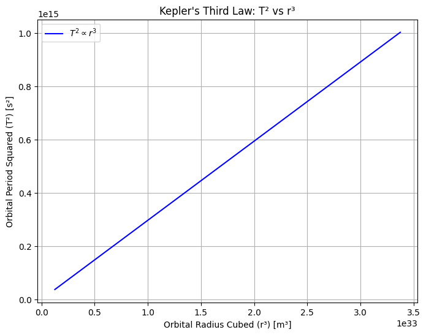
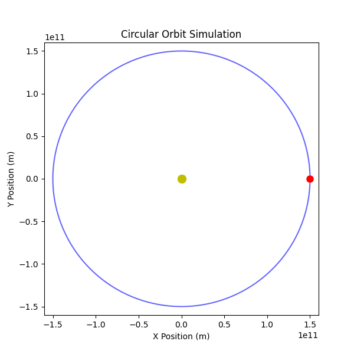
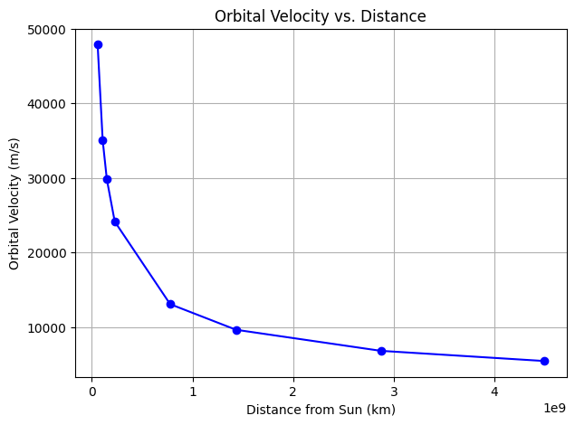

## Orbital Period and Orbital Radius

### Kepler’s Third Law
Kepler’s Third Law states that the square of the orbital period $T$ of a planet is directly proportional to the cube of its average orbital radius $r$.

$$ T^2 \propto r^3 $$

For circular orbits, Newton’s form of Kepler’s Third Law is derived using Newton’s law of gravitation and centripetal force:

$$ F = \frac{GMm}{r^2} = m \frac{v^2}{r} $$

where:
- $G$ is the gravitational constant,
- $M$ is the mass of the central body,
- $m$ is the mass of the orbiting body,
- $r$ is the orbital radius,
- $v$ is the orbital velocity.

Since orbital velocity is given by:

$v = \frac{2 \pi r}{T}$

Substituting this in and simplifying gives:

$T^2 = \frac{4 \pi^2 r^3}{GM}$

which confirms Kepler’s Third Law.

Kepler’s Third Law is crucial because it helps astronomers determine how long a planet takes to orbit the Sun. It is also used to calculate orbits of moons, asteroids, and exoplanets.

Also by rearranging the equation, we can determine the mass of stars and planets.

---

### 2. Implications for Astronomy
**Kepler’s Third Law is an essential tool in astronomy and astrophysics, enabling scientists to:**

- Measure planetary masses without direct observation.
- Estimate distances between celestial objects.
- Predict satellite and planetary motion for space missions.
- Discover and analyze exoplanets in distant star systems.
- Test fundamental physics like Newtonian gravity and Einstein’s relativity.

**Let's take a more detailed look:**

By using the modified form of Kepler’s Third Law : $T^2 = \frac{4 \pi^2 r^3}{GM}$

- If we know the orbital period (T) and radius (r) of a planet’s moon, we can calculate the planet’s mass (M).

- This method is used to determine the masses of planets like Jupiter and Saturn by studying their moons.

For example astronomers used the orbits of Jupiter’s moons (like Io and Europa) to determine Jupiter’s mass without ever visiting it.

**Next** is if we know the period of a planet around a star, we can estimate its distance from the star using: $$r^3 = \frac{G M T^2}{4\pi^2}$$

This is useful for exoplanet discovery, where astronomers measure an exoplanet’s orbital period (via transit method) and then estimate its distance from the star.

For example the TRAPPIST-1 system was analyzed using Kepler’s Third Law to determine how far each planet orbits from its star.

**Kepler’s Law** helps in space mission planning, ensuring satellites and space probes follow correct orbits.

It allows astronomers to predict planetary alignments, which is essential for eclipse calculations and planetary transits.

For example NASA used Kepler’s Third Law to calculate the orbital paths of the Voyager spacecraft, ensuring they reached their destinations accurately.

---

### 3. Real-World Examples
Kepler’s Third Law is widely used to analyze real-world celestial motions. Here are some significant examples

#### **3.1 Earth’s Orbit Around the Sun**
- The Earth takes **one year (365.25 days)** to orbit the Sun.
- The average distance between the Earth and the Sun (1 AU) follows Kepler’s Third Law:

$$ T^2 = a^3 $$

where $T = 1$ year and $a = 1$ AU.
- This relationship allows astronomers to compare other planetary orbits using the same proportionality.

#### **3.2 Moon’s Orbit Around Earth**
- The Moon takes **27.3 days** to complete one orbit around the Earth.
- Using Kepler’s Third Law, the distance between the Moon and Earth (~384,400 km) can be estimated.
- This method was used historically to refine our understanding of the Earth-Moon system.

#### **3.3 Jupiter’s Moons**
- Galileo observed Jupiter’s four largest moons (Io, Europa, Ganymede, and Callisto) in 1610.
- The moons follow Kepler’s Third Law, allowing astronomers to determine **Jupiter’s mass** by analyzing their orbits.
- **Example:** Io has an orbital period of **1.77 days**, and its distance from Jupiter is approximately **421,700 km**.

#### **3.4 Saturn’s Rings and Moons**
- Saturn’s moons follow Kepler’s Law, which helps determine their distances and periods.
- **Example:** Titan, Saturn’s largest moon, orbits at **1,222,000 km** and has a period of **16 days**.
- The rings of Saturn also follow Keplerian motion, with inner rings orbiting faster than outer rings.

#### **3.5 Exoplanet Discoveries**
- Kepler’s Third Law is extensively used in detecting and analyzing exoplanets.
- The **Kepler Space Telescope** measured periodic dimming of stars to find exoplanets and determine their distances from stars.
- **Example:** The exoplanet **Kepler-22b** orbits its star at a distance similar to Earth, making it a candidate for habitability.

#### **3.6 Artificial Satellites and Space Missions**
- Kepler’s Third Law helps in designing satellite orbits and planning interplanetary missions.
- **Example:** The International Space Station (ISS) orbits Earth every **92 minutes**, and geostationary satellites orbit every **24 hours** at **35,786 km**.
- Space agencies use Kepler’s Laws to calculate spacecraft trajectories, like the **Mars Rover missions**.

---

### 4. Computational Model in Python
**This plot demonstrates the direct proportionality between the square of the orbital period and the cube of the orbital radius.**

---
**This animation shows an object orbiting around a central mass.**

---
**Orbital Velocity vs. Distance (Demonstrating Gravity’s Effect)**

Outer planets move slower than inner planets due to weaker gravity.

**This plot shows orbital velocity $v$ vs. distance $r$.**

This plot shows that closer planets move faster (for example Mercury ~ 47 km/s).

Sequentally outer planets move slower (for example Neptune ~ 5 km/s)

It also confirms Newton’s Gravity Law $v = √(GM/r)$

---

**Here is the simulation of multiple planets moving in orbits**

**It shows that :**
- All planets moving at their correct speeds

- Inner planets move faster than outer planets

- Each planet moves at a different speed and distance

.gif>)

---

### 5. Extension to Elliptical Orbits
Kepler’s Third Law also applies to elliptical orbits, replacing $r$ with the **semi-major axis $a$**. The formula remains:

$$T^2 = \frac{4 \pi^2 a^3}{GM}$$

This generalization helps explain planetary orbits and spacecraft trajectories.
