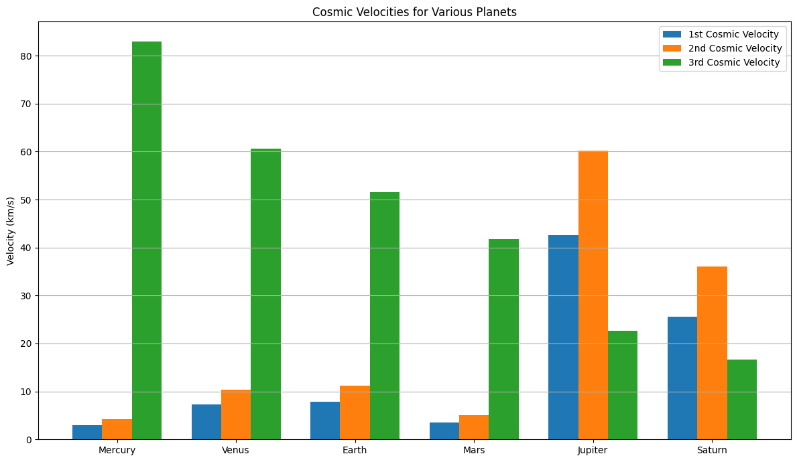
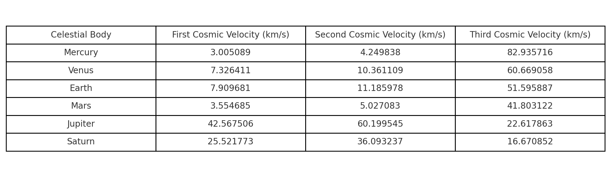

# Escape Velocities and Cosmic Velocities

## First, Second, and Third Cosmic Velocities

Understanding cosmic velocities is essential in space science, especially in the context of launching satellites, escaping planetary orbits, and venturing beyond the solar system.

---

### First Cosmic Velocity (Orbital Velocity)

**Definition:**  
The first cosmic velocity is the **minimum speed** an object must have to enter a **circular orbit around a planet or celestial body**, assuming it is close to the surface and ignoring atmospheric resistance.

**Formula:**  
$$
v_1 = \sqrt{\frac{GM}{R}}
$$  

Where:  

- $G = 6.67430 \times 10^{-11} \, \text{m}^3\text{kg}^{-1}\text{s}^{-2}$ (gravitational constant)  
- $M$ : Mass of the celestial body (e.g., Earth, Mars)  
- $R$ : Radius from the center of the body to the orbiting object  

**Physical Meaning:**  
This velocity allows an object to stay in **low Earth orbit (LEO)** — it constantly "falls" toward Earth but never hits it because the planet curves away beneath it.

**Example (Earth):**  

- Mass of Earth $M \approx 5.972 \times 10^{24} \, \text{kg}$  
- Radius of Earth $R \approx 6.371 \times 10^6 \, \text{m}$  

$$
v_1 = \sqrt{\frac{6.67430 \times 10^{-11} \times 5.972 \times 10^{24}}{6.371 \times 10^6}} \approx 7.9 \, \text{km/s}
$$

So, to stay in orbit around Earth, a spacecraft must travel at **~7.9 km/s** near the surface.

**Applications:**

- Satellites in LEO (e.g., ISS)  
- Earth observation missions  
- Weather and spy satellites  

---

### Second Cosmic Velocity (Escape Velocity)

**Definition:**  
The second cosmic velocity is the **minimum speed needed to break free** from a celestial body’s gravitational pull without further propulsion (ignoring atmospheric drag).

**Formula:**  
$$
v_2 = \sqrt{2GM/R} = \sqrt{2} \cdot v_1
$$  

**Physical Meaning:**  
At this speed, the object will leave the gravitational influence of the body and **never return**, unless slowed down or redirected.

**Example (Earth):**  
$$
v_2 = \sqrt{2} \cdot 7.9 \, \text{km/s} \approx 11.2 \, \text{km/s}
$$

To escape Earth's gravity and head to space (e.g., to the Moon or Mars), a spacecraft must travel at least **11.2 km/s**.

**Applications:**  

- Missions to the Moon, Mars, or other planets  
- Interplanetary spacecraft (e.g., Mars rovers)  
- Space probes (e.g., Voyager, Pioneer)

---

### Third Cosmic Velocity (Solar System Escape Velocity)

**Definition:**  
The third cosmic velocity is the **minimum speed required to leave the Sun’s gravitational field** starting from a planet’s orbit (typically Earth’s).

**Formula (simplified):**  
$$
v_3 = \sqrt{v_{e,\text{sun}}^2 + v_{\text{orb, Earth}}^2}
$$

Where:  

- $v_{e,\text{sun}}$: Escape velocity from the Sun at Earth’s distance  
- $v_{\text{orb, Earth}} \approx 29.8 \, \text{km/s}$: Earth’s orbital speed around the Sun

At Earth's orbit, the Sun’s gravitational escape velocity is about **42.1 km/s**. So:

$$
v_3 = \sqrt{(42.1)^2 + (29.8)^2} \approx 16.7 \, \text{km/s (relative to Earth)}
$$

**Note:** The third cosmic velocity is usually calculated in the **heliocentric (Sun-centered) frame**. To escape the Sun from Earth’s orbit, a spacecraft must exceed this combined speed.

**Applications:**  
- Interstellar missions (e.g., Voyager 1 & 2, New Horizons)  
- Missions to Oort Cloud or beyond  
- Theoretical future missions to nearby stars

---

# Mathematical Derivations of Cosmic Velocities

## First Cosmic Velocity – Orbital Velocity

### Derivation:
We derive the first cosmic velocity by equating the **gravitational force** to the **centripetal force** required for circular motion:

$$
F_{\text{gravity}} = F_{\text{centripetal}}
$$

$$
\frac{GMm}{R^2} = \frac{mv^2}{R}
$$

- $G$: Universal gravitational constant  
- $M$: Mass of the planet (e.g., Earth)  
- $m$: Mass of the satellite (cancels out)  
- $R$: Distance from the center of the planet  
- $v$: Orbital speed (1st cosmic velocity)

Solving for $v$:

$$
v_1 = \sqrt{\frac{GM}{R}}
$$

### Parameters affecting $v_1$:

- **Increases** with the planet's mass $M$  
- **Decreases** with greater orbital radius $R$

---

## 2. Second Cosmic Velocity – Escape Velocity

### Derivation:
Based on the **conservation of mechanical energy**. For an object to escape, its total energy at the surface must be **zero or more**:

$$
E_{\text{total}} = K + U = \frac{1}{2}mv^2 - \frac{GMm}{R} \geq 0
$$

Setting $E_{\text{total}} = 0$:

$$
\frac{1}{2}mv^2 = \frac{GMm}{R}
$$

Solving for $v$:

$$
v_2 = \sqrt{\frac{2GM}{R}} = \sqrt{2} \cdot v_1
$$

### Parameters affecting $v_2$:

- **Increases** with mass of planet $M$  
- **Decreases** with larger radius $R$  
- **Independent of the object's mass** (notice $m$ cancels out)

---

## 3. Third Cosmic Velocity – Solar System Escape Velocity

### Derivation (simplified):
To escape the **Sun’s gravity** from Earth’s orbit, we use energy conservation again:

$$
E_{\text{total}} = \frac{1}{2}mv^2 - \frac{GM_{\odot}m}{r}
$$

Where:  

- $M_{\odot}$: Mass of the Sun  
- $r$: Distance from Sun (approx. 1 AU)  
- $v$: Total heliocentric speed required

To find the required **excess speed** from Earth’s frame (3rd cosmic velocity), subtract Earth’s orbital velocity:

$$
v_3 = \sqrt{v_{\text{esc,Sun}}^2 + v_{\text{orb,Earth}}^2}
$$

Or more specifically:

$$
v_3 = \sqrt{\frac{2GM_{\odot}}{r}} - v_{\text{orb,Earth}}
$$

This gives the **minimum relative speed** a spacecraft must achieve to leave the solar system, assuming launch from Earth.

### Parameters affecting $v_3$:

- **Increases** if launched closer to the Sun (smaller $r$)  
- **Decreases** with higher starting orbital velocity (e.g., a gravity assist from Jupiter)

---

## Summary of Parameters Affecting Velocities

Each of the cosmic velocities is influenced by different physical parameters, primarily the **mass of the celestial body** and the **distance (radius)** from its center.

- For the **first cosmic velocity** (orbital velocity), the speed increases with the **mass** of the planet or star because a more massive body exerts a stronger gravitational pull. However, it decreases with a **larger radius** — meaning the farther away you are from the center, the less speed you need to stay in orbit.

- The **second cosmic velocity** (escape velocity) follows a similar pattern. It also increases with the planet’s **mass**, as a more massive object requires more energy to escape its gravitational field. Likewise, a **greater radius** from the center of mass lowers the escape speed, since gravity weakens with distance.

- The **third cosmic velocity**, which is the speed needed to escape the entire **Solar System**, depends primarily on the **mass of the Sun** and the object’s **distance from the Sun** (typically Earth’s orbital radius). Additionally, this velocity is affected by the **orbital speed** of Earth — spacecraft already moving at Earth’s orbital velocity need to add less additional speed to break free from the Sun’s gravity.

In all three cases, it’s important to note that the **mass of the spacecraft itself does not influence** these required speeds — only the masses of the celestial bodies and the distances involved matter.

---

# Cosmic Velocities For Various Planets

## Analysis of Parameters and Derivations Behind Cosmic Velocities

Here i will explain the core physical parameters and derivations used to calculate the **first**, **second**, and **third cosmic velocities** for different celestial bodies. The calculations were based on established physics formulas and astronomical data.

---

### Parameters Used

### 1. Gravitational Constant (G)

- **Symbol:** $G$
- **Value:** $6.67430 \times 10^{-11} \, \text{m}^3 \, \text{kg}^{-1} \, \text{s}^{-2}$
- **Explanation:** A universal constant that governs the strength of gravitational attraction between two masses. It is constant across the universe.

---

### 2. Mass of the Celestial Body (M)

- Each planet's known mass (in kg) is used to calculate gravitational effects.
- Example:
  - Earth: $5.972 \times 10^{24} \, \text{kg}$
  - Jupiter: $1.898 \times 10^{27} \, \text{kg}$
- **Effect:** Greater mass increases gravitational pull, requiring higher velocities to orbit or escape.

---

### 3. Radius of the Celestial Body (R)

- The average distance from the center of the planet to its surface.
- Example:
  - Earth: $6.371 \times 10^6 \, \text{m}$
  - Mars: $3.3895 \times 10^6 \, \text{m}$
- **Effect:** A larger radius weakens surface gravity and reduces the required velocities.

---

### 4. Orbital Radius from the Sun (r)

- The average distance from each planet to the Sun.
- Example:
  - Earth: $1.496 \times 10^{11} \, \text{m}$ (1 AU)
  - Jupiter: $7.785 \times 10^{11} \, \text{m}$
- **Effect:** Greater distance reduces the Sun’s gravitational pull, making it easier to escape the solar system.

---

## Derivations of the Velocities

### First Cosmic Velocity — $v_1$

**Formula:**
$$
v_1 = \sqrt{\frac{GM}{R}}
$$

**Derivation:**
From balancing gravitational force and centripetal force:
$$
\frac{GMm}{R^2} = \frac{mv^2}{R}
$$
Solving gives:
$$
v = \sqrt{\frac{GM}{R}}
$$

**Meaning:** The speed needed to stay in a circular orbit around a planet, close to its surface.

---

### Second Cosmic Velocity — $v_2$

**Formula:**
$$
v_2 = \sqrt{\frac{2GM}{R}} = \sqrt{2} \cdot v_1
$$

**Derivation:**
Using energy conservation:
$$
\frac{1}{2}mv^2 - \frac{GMm}{R} = 0
$$
Solving gives:
$$
v = \sqrt{\frac{2GM}{R}}
$$

**Meaning:** The minimum speed needed to escape the planet’s gravity without further propulsion.

---

### Third Cosmic Velocity — $v_3$

**Formula:**
$$
v_3 = \sqrt{v_{\text{esc,Sun}}^2 + v_{\text{orb,planet}}^2}
$$

Where:

- $v_{\text{esc,Sun}} = \sqrt{\frac{2GM_{\odot}}{r}}$
- $v_{\text{orb,planet}} = \sqrt{\frac{GM_{\odot}}{r}}$

**Simplified form:**
$$
v_3 = \sqrt{\frac{3GM_{\odot}}{r}}
$$

**Meaning:** The speed needed to escape the Sun’s gravitational field, starting from a given planet’s orbit.

---

## Observations and Insights

- **Mass matters**: More massive planets have stronger gravity, increasing both orbital and escape speeds.
- **Radius helps**: A larger planetary radius reduces surface gravity, slightly lowering required speeds.
- **Solar distance reduces escape needs**: The farther a planet is from the Sun, the lower the third cosmic velocity needed to escape the Solar System.
- **Third velocity is indirect**: It depends on both Sun’s gravitational pull and the orbital motion of the planet — because a spacecraft can use this existing orbital motion to its advantage.

---

## Conclusion

These calculations and visualizations help us understand the complex but predictable nature of motion in space. They show how both local planetary properties and broader solar system mechanics govern space travel requirements — from low Earth orbit missions to interstellar exploration.

---

# Importance of Cosmic Velocities in Space Exploration

Understanding and applying the concepts of **first**, **second**, and **third cosmic velocities** is foundational to the field of space exploration. These velocities define the thresholds for achieving orbit, escaping planetary gravity, and ultimately leaving the Solar System — making them critical for mission design, fuel calculations, and spacecraft engineering.

---

## 1. First Cosmic Velocity — Low Earth Orbit & Satellites

The **first cosmic velocity** defines the **minimum speed** required for a spacecraft to enter a **stable circular orbit** around a planet without falling back to the surface.

### Applications:

- **Launching artificial satellites** (e.g., communications, weather, GPS)
- **Space stations** (e.g., the International Space Station orbits Earth at ~7.66 km/s)
- **Earth observation missions** (e.g., environmental monitoring, spy satellites)
- **Reusable spacecraft** (e.g., SpaceX Starlink launches)
- **Crewed missions in low Earth orbit**

### Why It Matters:

- Accurate calculation ensures **sufficient speed** to maintain orbit without **wasting fuel**.
- Too slow: object falls back. Too fast: it might escape into a higher orbit or even space.

---

## 2. Second Cosmic Velocity — Interplanetary Missions

The **second cosmic velocity** is the **escape velocity** from a planet — the minimum speed needed to **break free of the planet’s gravitational pull**.

### Applications:

- **Moon missions** (e.g., Apollo program)
- **Mars missions** (e.g., Perseverance rover, Mars Express)
- **Planetary flybys and orbiters** (e.g., Cassini at Saturn, Juno at Jupiter)
- **Sample return missions** (e.g., OSIRIS-REx)

### Why It Matters:

- Defines how much **thrust and fuel** is required to send a spacecraft toward another celestial body.
- Determines **launch window** calculations and transfer orbit strategies (like Hohmann transfers).
- Critical for designing **stages of launch vehicles** — especially for missions leaving Earth’s gravity well.

---

## 3. Third Cosmic Velocity — Interstellar Exploration

The **third cosmic velocity** refers to the **speed required to leave the Solar System entirely**, escaping the gravitational influence of the Sun starting from a planetary orbit.

### Applications:

- **Interstellar probes** (e.g., Voyager 1 & 2, which are now in interstellar space)
- **Missions to the Oort Cloud or beyond**
- **Theoretical star missions** (e.g., Breakthrough Starshot)

### Why It Matters:

- Currently, only a few spacecraft have achieved this velocity — they required **planetary gravity assists** to gain enough speed.
- Informs planning for **future interstellar exploration**.
- Critical for understanding **limits of propulsion systems** and **duration of deep-space missions**.

---

## Broader Impact on Space Science

- Helps define the **energy requirements** for every phase of a space mission — from launch to landing, and beyond.
- Influences **propulsion system design**, such as chemical rockets, ion thrusters, or nuclear thermal propulsion.
- Guides **mission planning**, including optimal launch windows and gravitational assist trajectories.
- Sets realistic expectations for **mission duration**, fuel efficiency, and costs.

---

## Future Exploration Considerations

- As we push toward missions to **Mars**, **outer planets**, and even **exoplanets**, understanding cosmic velocities becomes even more essential.
- Enables **efficient resource use**, especially for missions with limited mass/fuel budgets.
- Provides a framework for advancing technologies that might one day reach **relativistic speeds** (e.g., light sails, antimatter drives).

---

## Conclusion

Cosmic velocities are not just theoretical thresholds — they are **engineering constraints**, **mission goals**, and **safety parameters**. From keeping satellites in orbit to escaping the entire Solar System, they serve as the invisible lines that shape humanity’s journey beyond Earth.
