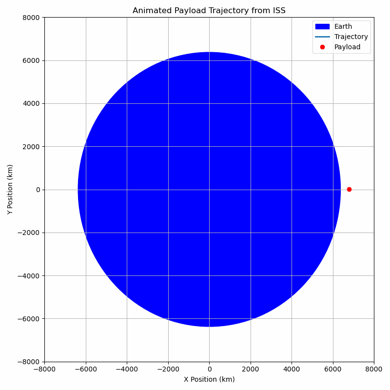
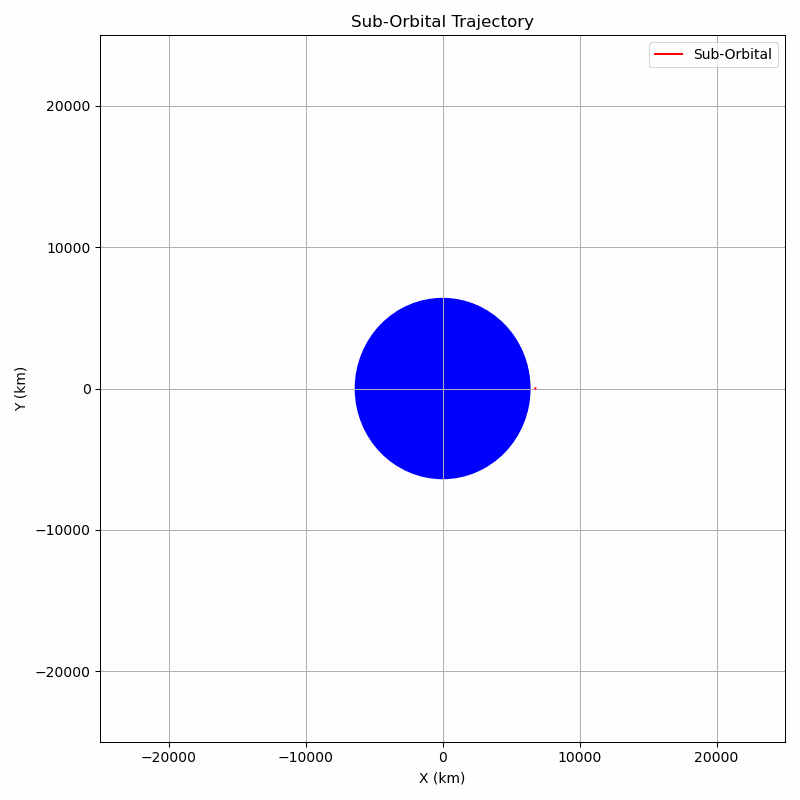

# Problem 3. Analyzing Possible Trajectories of a Payload Released Near Earth

When a payload is released from a moving rocket near Earth, it enters a new trajectory that depends entirely on its **initial conditions** — specifically, its **velocity**, **direction**, and **altitude** at the moment of release. The nature of this trajectory is determined by the balance between the payload’s kinetic energy and Earth’s gravitational pull.

The result will be one of several possible **conic section trajectories**: **elliptical**, **parabolic**, **hyperbolic**, or **sub-orbital**. These paths are not only mathematically distinct but also have **critical implications for space operations**, such as satellite deployment, reentry, or interplanetary missions.

---

## 1. Elliptical Trajectory

### What It Is:

An **elliptical orbit** is a closed curved path where the payload remains **bound to Earth**. This is the most common type of orbit used by satellites, where the payload continues to circle the planet indefinitely (barring drag or propulsion changes).

### Conditions:

- The total mechanical energy $E = K + U$ is **negative**.
- The payload’s velocity at release is **less than escape velocity** but **more than the minimum orbital speed** at that altitude.
- Eccentricity $0 < e < 1$, where $e = 0$ is a perfect circle.

### Examples:

- Satellites in Low Earth Orbit (LEO), Medium Earth Orbit (MEO), or Geostationary Orbit (GEO).
- The International Space Station (ISS).
- The Moon, in its natural elliptical orbit around Earth.

---

## 2. Parabolic Trajectory

### What It Is:

A **parabolic trajectory** is the boundary case between elliptical and hyperbolic motion. It represents the **minimum velocity** required for a payload to escape Earth’s gravitational pull, without having any excess speed.

### Conditions:

- The total mechanical energy $E = 0$.
- The payload’s velocity is **exactly equal to escape velocity**:
  $$
  v_{\text{escape}} = \sqrt{\frac{2GM}{R}}
  $$
- Eccentricity $e = 1$.

### Example:

- A theoretical spacecraft released at exactly the escape speed from Earth, heading infinitely outward, slowing down but never stopping or returning.

---

## 3. Hyperbolic Trajectory

### What It Is:

A **hyperbolic trajectory** occurs when the payload has **more than enough energy** to escape Earth’s gravity. The trajectory is an open curve, and the payload will **never return**.

### Conditions:

- Total mechanical energy $E > 0$.
- The velocity at release is **greater than escape velocity**.
- Eccentricity $e > 1$.

### Examples:

- Interplanetary or interstellar probes (e.g., Voyager 1, New Horizons).
- Gravity assist maneuvers that increase speed for Solar System escape.

---

## 4. Sub-Orbital (Ballistic) Trajectory

### What It Is:

In a **sub-orbital trajectory**, the payload doesn’t have enough horizontal speed to enter a full orbit. Instead, it rises along a curved path and eventually **falls back** to Earth under gravity.

### Conditions:

- Total mechanical energy $E < 0$, but trajectory intersects Earth.
- Initial speed is **less than orbital velocity**.
- Path is part of an ellipse, but not a closed orbit.

### Examples:

- Ballistic missiles and sounding rockets.
- Space tourism flights (e.g., Blue Origin’s New Shepard).
- Capsules launched to space and returned without full orbit.

---

## Why This Matters

Understanding these trajectories is essential in mission planning:

- **Orbital missions** need precise speed for stable elliptical paths.
- **Escape missions** (e.g., heading to Mars) must exceed escape velocity.
- **Reentry missions** use sub-orbital physics to safely return to Earth.
- **Gravity assists** exploit hyperbolic paths to increase spacecraft speed.

Every possible trajectory a payload can follow after release falls into one of these categories. These are not just abstract physics — they’re the **fundamental flight paths** used in satellite deployment, planetary exploration, and returning spacecraft to Earth. Mastery of these trajectories is foundational for anyone working in aerospace, astrodynamics, or space mission design.

---

# Numerical Analysis of a Payload's Path Near Earth

## Objective

The goal is to **numerically compute** and visualize the trajectory of a payload released from a moving spacecraft near Earth. The motion is influenced only by Earth's gravity, and we analyze how different **initial velocities** and **positions** affect the path of the payload.

I base this simulation on **real orbital parameters** of the **International Space Station (ISS)** to keep our model grounded in reality.

---

## Physical Background

The trajectory of a freely falling object under gravity can be predicted using **Newton's Law of Universal Gravitation**:

$$
\vec{F} = -G \frac{M m}{r^2} \hat{r}
$$

Where:

- $G$: Gravitational constant ($6.67430 \times 10^{-11} \, \text{m}^3 \, \text{kg}^{-1} \, \text{s}^{-2}$)
- $M$: Mass of Earth
- $m$: Mass of payload
- $r$: Distance from Earth's center

From Newton’s Second Law:

$$
\vec{a} = \frac{\vec{F}}{m} = -G \frac{M}{r^2} \hat{r}
$$

We numerically integrate the acceleration to compute velocity and position over time using the **Euler method**.

---

## Real Data: ISS as Reference

We use real International Space Station orbital parameters to simulate a realistic release scenario:

| Parameter           | Value                |
|---------------------|----------------------|
| Altitude            | ~408 km              |
| Orbital Speed       | ~7.66 km/s           |
| Orbit Type          | Circular (LEO)       |
| Mass of Earth       | $5.972 \times 10^{24} \, \text{kg}$ |
| Earth Radius        | $6.371 \times 10^6 \, \text{m}$     |

---

## Initial Conditions

- **Position**: $r = R_{\text{Earth}} + 408 \, \text{km}$
- **Velocity**: $v = 7.66 \, \text{km/s}$ (tangential to surface)
- **Duration**: 6000 seconds
- **Time Step**: 1 second

These represent a scenario where the payload is released directly from the ISS.

---

## Python Simulation

I implemented a simple 2D numerical simulation using the **Euler method**. At each step, the gravitational acceleration is calculated based on the current distance from Earth's center, and position and velocity are updated accordingly.

Key components:
- Arrays to track position and velocity
- Gravity-based acceleration calculated at each step
- Integration over time to model motion

The simulation produces a **closed orbital path**, confirming that a payload released at ISS speed and altitude remains in **low Earth orbit**.

The simulation shows the trajectory computed in the simulation:

- The **blue circle** represents Earth.
- The **curved path** shows the orbital trajectory of the payload.
- Since the initial speed matches orbital velocity, the payload **does not fall back** or escape — it orbits stably.

**This confirms the correctness of our setup and demonstrates how real mission data can be used to simulate and predict orbital motion accurately.
dw**

This numerical analysis demonstrates that:

- A payload released from ISS at orbital velocity remains in orbit.
- Adjusting the velocity slightly would change the trajectory type (e.g., sub-orbital reentry or hyperbolic escape).
- Simulations like this are vital for predicting and designing **orbital maneuvers, reentry trajectories**, or **planetary transfers**.

This analysis bridges **theory and application**, showing how core gravitational physics governs real spacecraft motion.

---

# Relationship Between Trajectory Types and Spaceflight Scenarios

When an object is released near a planet or other massive body, it follows a path determined entirely by its **initial velocity**, **direction**, and **altitude**. These factors influence the object's **total mechanical energy**, which in turn dictates the nature of its trajectory.

This trajectory directly determines whether the object will:

- **Enter orbit** and remain bound to the planet,
- **Reenter** the atmosphere and fall back,
- Or **escape** the planet’s gravity altogether.

---

## Orbital Insertion — Stable Bound Motion

If the object is released with a **sufficient tangential speed**, it will not fall back to the planet but instead will continuously "fall around" it. This is called **orbital motion**. The gravitational pull provides the centripetal force needed to keep it in a **closed curved path**.

### Characteristics:

- The trajectory is an **ellipse** (or a **circle** if speed and altitude are just right).
- The object is **gravitationally bound** to the planet.
- Its total mechanical energy (kinetic + potential) is **negative**, indicating that it lacks enough energy to escape.
- This condition is called **orbital insertion**, where a moving object is successfully placed into a stable orbit.

### Conditions:

- The object's velocity is **greater than the minimum required to stay aloft**, but **less than escape velocity**.
- The gravitational force continuously pulls the object toward the planet, curving its path into an ellipse.

---

## Reentry — Incomplete Bound Motion

If the object is released with a velocity that is **too low to achieve orbit**, gravity will overcome its forward motion and pull it back toward the planet. The object follows a **partial elliptical trajectory** that intersects with the surface.

### Characteristics:

- The trajectory is part of an ellipse, but not a full orbit.
- The object’s path **intersects the planet**, leading to impact or reentry into the atmosphere.
- The total mechanical energy is still **negative**, as the object is not escaping gravity, but it cannot sustain orbit.

### Conditions:

- The velocity is **less than the minimum orbital speed** at that altitude.
- The object lacks enough horizontal motion to counteract gravity, so it eventually descends back.

---

## Escape — Unbound Motion

If the object is released with a **very high velocity**, it may completely overcome the gravitational pull of the planet. It follows an **open trajectory** — either a **parabola** or a **hyperbola** — depending on how much energy it has.

### Case A: Parabolic Trajectory

- The object’s total mechanical energy is exactly **zero**.
- This means it has just enough speed to escape, but no energy left over.
- The trajectory is a perfect parabola.
- The object slows down infinitely as it moves away, never returning.

### Case B: Hyperbolic Trajectory

- The object’s total energy is **positive**.
- This means it escapes and **keeps some kinetic energy**, continuing to move indefinitely.
- The trajectory is a hyperbola.
- The object is permanently unbound from the planet’s gravity.

### Conditions for Escape:

- The velocity must be **equal to or greater than escape velocity**:
  $$
  v_{\text{escape}} = \sqrt{\frac{2GM}{r}}
  $$
  where:
  - $G$ is the gravitational constant,
  - $M$ is the mass of the planet,
  - $r$ is the distance from the planet’s center.

---

Each of these outcomes — orbit, fall, or escape — is governed by **basic energy and motion principles** in gravitational fields. By controlling the speed and angle at which an object is released, we determine the kind of journey it will take.

---

## Trajectory animations

### Orbital Trajectory (Elliptical)

**Initial Velocity:** ~7670 m/s

In this case, the payload is given just enough tangential velocity at 400 km altitude to continuously fall around Earth without hitting it. The gravitational force provides the centripetal acceleration needed to maintain a closed curved path.

The trajectory appears smooth and symmetric — either nearly circular or gently elliptical depending on precision. The object’s total mechanical energy is **negative**, meaning it is **gravitationally bound** to Earth. This is a classic example of orbital motion.

---

### Sub-Orbital Trajectory

**Initial Velocity:** ~6000 m/s

Here, the object is released with **insufficient velocity** to remain in orbit. As a result, it rises briefly, follows a curved path (a segment of an ellipse), and then **falls back to Earth**.

The gravitational pull is too strong to be countered by the object’s horizontal motion. This leads to a **sub-orbital** flight, where the object follows an elliptical arc that intersects with Earth's surface. This is typical for objects on reentry or ballistic flights.

---

### Parabolic Trajectory

**Initial Velocity:** ~11,180 m/s

This is the **exact escape velocity** at the given altitude. The object has just enough energy to **overcome Earth’s gravity** but not a bit more. As a result, the trajectory forms a **parabola** — the object continually slows down as it moves away but never returns.

In energy terms, its total mechanical energy is **zero**, marking the precise threshold between bound and unbound motion.

---

### Hyperbolic Trajectory

**Initial Velocity:** ~12,000 m/s

The payload is released with a velocity greater than escape velocity. It not only escapes Earth’s gravity but also retains some **excess kinetic energy**, allowing it to move away **indefinitely** at a nonzero speed.

The resulting trajectory is **hyperbolic** — an open curve. This represents **unbound motion**, where the object is no longer affected by the planet in any meaningful way beyond the initial encounter.