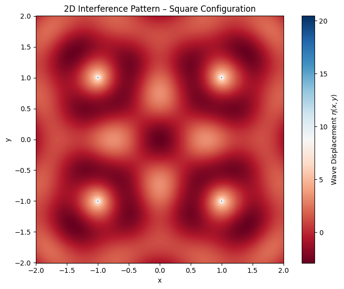
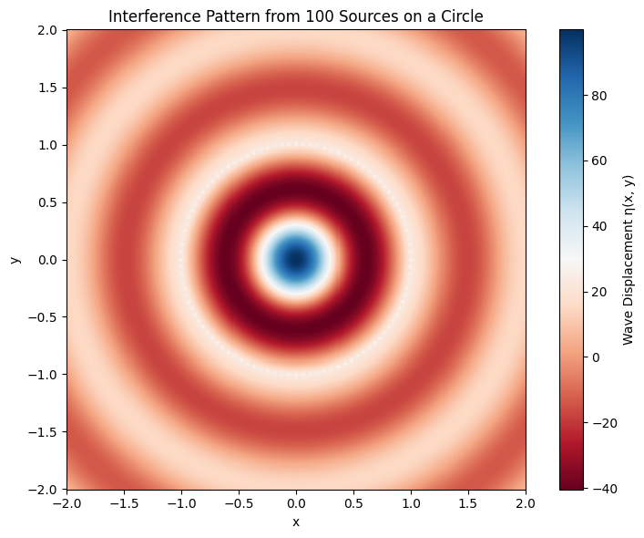

# Wave Interference Simulation: Regular Polygon Configuration

## Introduction

Wave interference is a fundamental concept in physics where multiple waves interact in space and time. When waves from different sources overlap, the total displacement at any point is given by the **principle of superposition**—they simply add together. This leads to regions of:

- **Constructive interference** (amplitudes reinforce)
- **Destructive interference** (amplitudes cancel)

---

## Problem Setup

We choose a **square configuration** for simplicity and symmetry. Each corner of the square acts as a point source, all emitting coherent waves.

### Assumptions:

- All sources emit waves with the same parameters: amplitude $A$, wavelength $\lambda$, frequency $f$, and phase $\phi = 0$
- Medium is uniform and infinite in extent
- No reflection or damping
- Time is fixed to analyze a snapshot of the wave field (we can animate later)

---

### Select a Regular Polygon

We begin by choosing a **square** as our polygon. This choice offers several advantages:

- It is symmetric, which makes patterns easier to interpret.
- It has enough complexity (4 sources) to produce rich interference, but is not overly complicated.
- It allows a balanced spatial distribution of wave sources.

The vertices of the square will be equally spaced around the origin for symmetry and ease of calculation.

---

### Position the Sources

We position four wave sources at the corners of a square centered at the origin. Assuming a side length of 2 units, the coordinates of the sources are:

- $(x_1, y_1) = (-1, -1)$
- $(x_2, y_2) = (-1, 1)$
- $(x_3, y_3) = (1, -1)$
- $(x_4, y_4) = (1, 1)$

This configuration ensures all wave sources are equidistant from the center, promoting symmetric interference.

Each of these sources will emit a circular wave described by the same functional form, differing only in spatial origin.

---

### Wave Equations

For a single source located at $(x_i, y_i)$, the wave it generates at point $(x, y)$ and time $t$ is:

$$
\eta_i(x, y, t) = \frac{A}{\sqrt{r_i}} \cdot \cos(k r_i - \omega t + \phi)
$$

Where:

- $r_i = \sqrt{(x - x_i)^2 + (y - y_i)^2}$
- $A = 1$, $\lambda = 1 \Rightarrow k = 2\pi$
- $f = 1 \Rightarrow \omega = 2\pi$
- $\phi = 0$ (all waves are in phase)

Thus, each of the four wave sources will have a unique $r_i$, but all other parameters are identical.

---

### Superposition of Waves

By the **principle of superposition**, the total displacement $\eta_{\text{sum}}(x, y, t)$ at each point is the sum of the displacements from all sources:

$$
\eta_{\text{sum}}(x, y, t) = \sum_{i=1}^{4} \eta_i(x, y, t)
$$

This formula accounts for both **constructive** and **destructive interference**, depending on the phases of the individual waves at any point.

In Python, this is implemented by calculating each $\eta_i$ on a grid and summing them element-wise.

---

### Next Step

With the wave equations and source positions defined, we're now ready to **simulate and analyze** the resulting interference pattern. In the next sections, we'll:

- Compute the summed wave field over a 2D grid
- Visualize the results using heatmaps
- Interpret the physics behind the observed pattern

---

### Analyze Interference Patterns

After computing the total wave displacement $\eta_{\text{sum}}(x, y, t)$, we analyze how the superposition of the individual waves creates regions of constructive and destructive interference.

#### Constructive Interference:

Occurs when wave crests (or troughs) from multiple sources meet. Mathematically, this happens when the arguments of the cosine functions are in phase:

- $\cos(k r_1 - \omega t) \approx \cos(k r_2 - \omega t)$
- Result: amplitudes **add up**, producing large values in $\eta_{\text{sum}}$

#### Destructive Interference:

Occurs when a crest from one wave meets a trough from another, causing cancellation. This corresponds to:

- Cosines being **out of phase** (e.g. one is positive, the other is negative)
- Result: $\eta_{\text{sum}}$ approaches **zero**

#### Observations:

- **Symmetric patterns** centered around the polygon.
- **Interference fringes** — bands of alternating high and low displacement.
- Regions where wave energy is focused vs. cancelled.

We'll generate a 2D heatmap to visualize these features in the next step.

---

### 6. Visualization

To visualize the interference, we create a 2D plot of the water surface at a fixed time $t = 0$.

---

## Interference Pattern Analysis

After simulating wave superposition from different source configurations, we can now interpret the results for both:

- A **square configuration** (4 sources)
- A **circular configuration** (100 sources forming a regular 100-gon)

---

### Case 1: Square Configuration (4 Sources)

#### Description:

- Four coherent point sources are placed at the corners of a square.
- Each emits a circular wave of the same amplitude, frequency, and phase.
- The interference pattern is generated by summing their contributions at each point on the grid.

#### Pattern Characteristics:

- **Symmetric Interference**: Due to the square's rotational and reflectional symmetry, the resulting pattern is also symmetric about both axes and diagonals.
- **Grid-like Fringes**: Constructive and destructive interference form a grid or checkerboard-like pattern, particularly near the center.
- **Bright Nodes (Maxima)**: Where wavefronts meet in phase, the amplitudes reinforce.
- **Dark Nodes (Minima)**: Where crest and trough cancel out, destructive interference occurs.

#### Physical Insight:

- The square geometry causes wavefronts to overlap in consistent, repeatable ways.
- These overlaps create a **stationary interference pattern**, highlighting wave superposition principles clearly.
- This is similar to **multi-slit interference**, but in 2D space with radial waves.

---

### Case 2: Circular Configuration (100 Sources)

#### Description:

- 100 wave sources are placed evenly around a circle, forming a regular 100-gon.
- As the number of vertices increases, the shape approximates a continuous ring.

#### Pattern Characteristics:

- **Radial Symmetry**: The circular arrangement produces a pattern that is symmetric about the origin in all directions.
- **Concentric Rings**: Bright and dark circular fringes appear, similar to ripples or Airy disks in optics.
- **High Density of Interference Nodes**: Due to the large number of overlapping wavefronts, there are many fine structures—regions of intense constructive and destructive interference.

#### Physical Insight:

- This setup mimics a **circular wavefront array**, similar to what you’d see in:

  - Holography
  - Optical diffraction through a circular aperture
  - Ripple tank experiments with ring-shaped disturbances

- The pattern complexity increases with the number of sources: more sources = more intricate interference zones.
- At the center, the constructive interference is often dominant, forming a bright central spot or **focus** point.

---

### Comparing the Two:

| Feature                     | Square (4 sources)       | Circle (100 sources)            |
|----------------------------|--------------------------|----------------------------------|
| Geometry                   | Discrete square vertices | Near-continuous circular ring    |
| Symmetry                   | 4-fold (rotational + mirror) | Full radial symmetry         |
| Pattern Shape              | Grid-like                | Concentric ripples / rings       |
| Interference Complexity    | Moderate (easily traceable) | High (dense structure)       |
| Visual Analogy             | 2D double-slit            | Circular aperture diffraction    |
| Educational Use            | Great for basic understanding | Shows advanced interference behavior |

---

### Conclusion:

- The **square configuration** is ideal for understanding basic principles of wave superposition and symmetry.
- The **100-source circular configuration** demonstrates how rich and detailed interference patterns can become as the number of sources increases.
- Both cases visually reveal how geometry affects the way waves overlap and interact — a core idea in both classical and modern physics (e.g., optics, acoustics, quantum mechanics).

---
