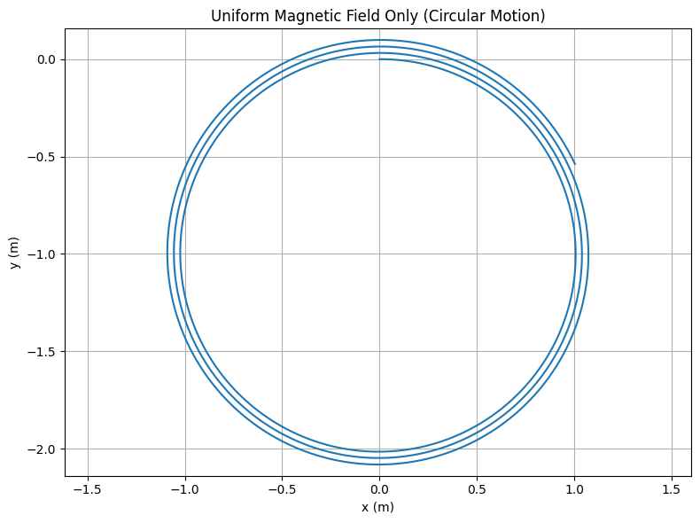
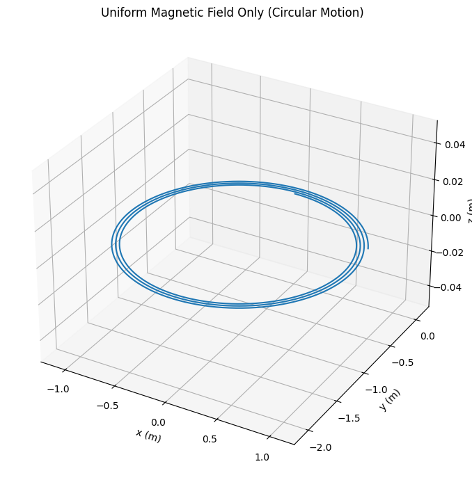
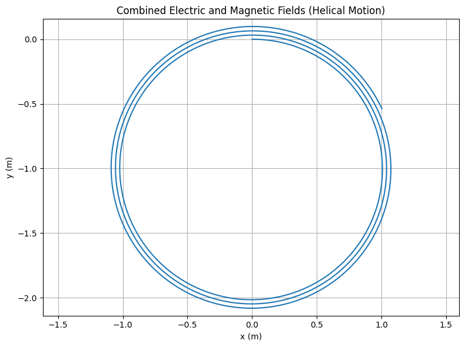
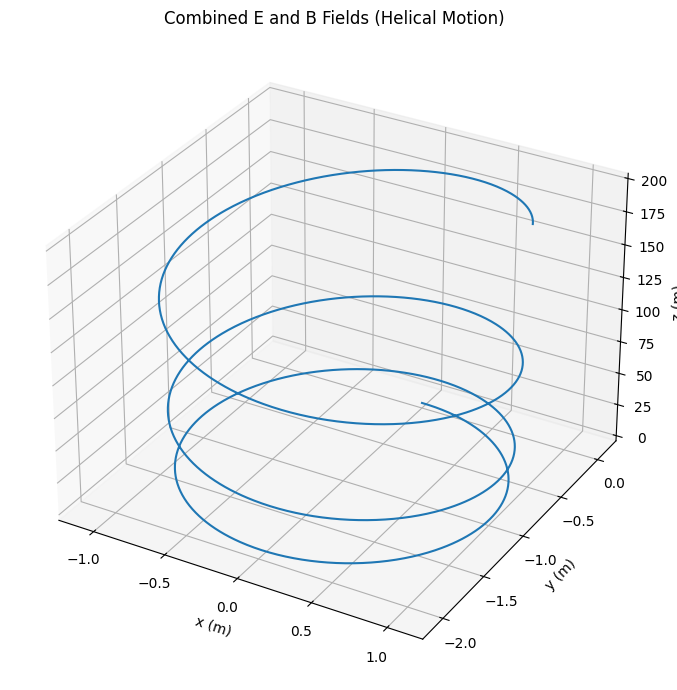
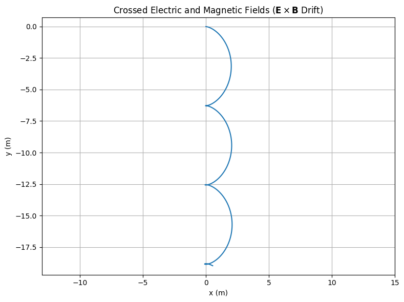
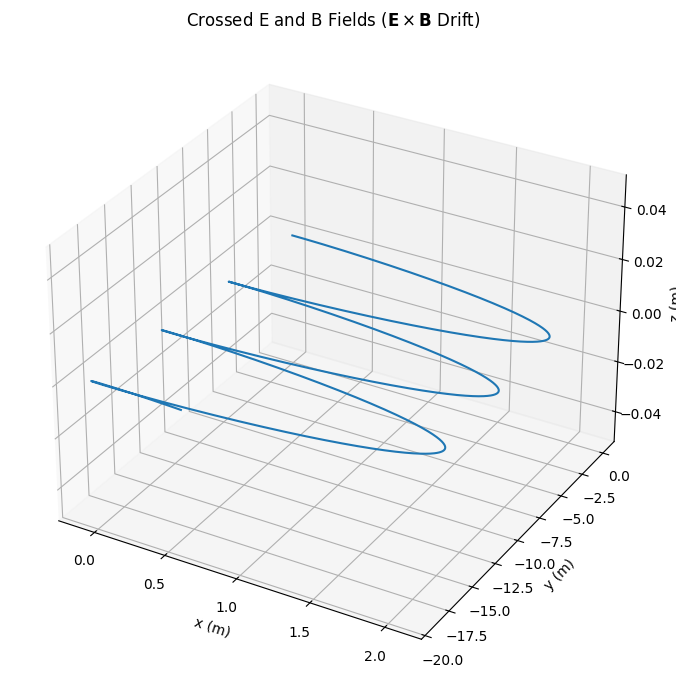

# Simulating the Effects of the Lorentz Force

## Introduction

The motion of charged particles under the influence of electric and magnetic fields is a cornerstone of classical electromagnetism and has deep relevance in modern physics and engineering. At the heart of this motion lies the **Lorentz force**, expressed as:

$$
\mathbf{F} = q\mathbf{E} + q\mathbf{v} \times \mathbf{B}
$$

This vector equation describes how a charged particle (with charge $q$) experiences a force due to an electric field $\mathbf{E}$ and a magnetic field $\mathbf{B}$, depending also on its velocity $\mathbf{v}$. The interplay of these fields can lead to complex, often non-intuitive, trajectories, especially when both fields are present and oriented differently.

Understanding the behavior of particles subjected to the Lorentz force is crucial in a variety of real-world applications. For example, it is the foundational principle behind the operation of:

- **Particle accelerators**, where beams of charged particles are steered and focused by electromagnetic fields
- **Mass spectrometers**, where particles follow curved paths based on their charge-to-mass ratio
- **Cyclotrons and synchrotrons**, which rely on controlled circular or spiral motion
- **Plasma confinement systems** in nuclear fusion devices, where particles must be held in place by complex magnetic configurations
- **Astrophysical plasmas**, where charged particles move under cosmic-scale magnetic fields

Due to the complexity of solving the Lorentz force analytically in most real scenarios, simulations are essential. They allow us to visualize how varying initial conditions and field strengths affect the particle's trajectory. From simple circular motion in a uniform magnetic field to helical paths in crossed fields, simulations offer insight that bridges mathematical formalism and physical intuition.

In this assignment, we will explore the effects of the Lorentz force by implementing computational simulations of particle motion in different electromagnetic field configurations. We will begin with simple uniform fields and gradually incorporate more complexity, while analyzing how parameters such as velocity, charge, mass, and field strength influence the motion. Ultimately, we aim to draw meaningful connections between our simulated results and real-world systems.

## Exploration of Applications

The Lorentz force plays a critical role in numerous physical systems and technologies. Below, we examine some of the key domains where its effects are central to the function of devices or the understanding of natural phenomena.

### Key Systems Influenced by the Lorentz Force

- **Particle Accelerators**:  
  In synchrotrons and cyclotrons, charged particles are accelerated to high speeds using electric fields, while magnetic fields guide them along circular or spiral paths. The Lorentz force ensures that particles are kept on track while gaining energy, making it possible to reach extremely high velocities.

- **Mass Spectrometers**:  
  These instruments use magnetic fields to bend the paths of ions according to their mass-to-charge ratio. The radius of curvature, determined by the balance of Lorentz and centripetal forces, allows scientists to identify the mass of unknown compounds with high precision.

- **Plasma Confinement (e.g., Tokamaks)**:  
  In fusion reactors, the Lorentz force is essential for confining plasma — a state of matter made of free electrons and ions. Strong magnetic fields are used to force particles into helical paths, preventing them from colliding with the walls of the containment vessel.

- **Astrophysical Plasmas**:  
  The motion of charged particles in the solar wind, planetary magnetospheres, and accretion disks is governed by the Lorentz force. These environments often contain large-scale magnetic fields that channel and accelerate particles across vast distances.

### Relevance of $\mathbf{E}$ and $\mathbf{B}$ Fields

- The **electric field** $\mathbf{E}$ contributes a linear force in the direction of the field, accelerating particles uniformly. It is responsible for changing the **speed** (kinetic energy) of the particle.

- The **magnetic field** $\mathbf{B}$, in contrast, exerts a force perpendicular to both the field and the particle’s velocity. It changes the **direction** of motion without affecting the speed, often resulting in circular or helical trajectories.

- When **both fields** are present, the particle can experience complex motion, such as drift (when electric and magnetic fields are perpendicular), or acceleration and curvature simultaneously, depending on their relative orientations.

---
## Simulating Particle Motion

In this section, we aim to simulate the motion of a charged particle under the influence of the Lorentz force in various electromagnetic field configurations. The goal is to visualize and analyze the particle’s trajectory in each case, revealing how different fields and initial conditions influence its motion.

The Lorentz force acting on a particle of charge $q$ and velocity $\mathbf{v}$ in electric and magnetic fields $\mathbf{E}$ and $\mathbf{B}$ is given by:

$$
\mathbf{F} = q\mathbf{E} + q\mathbf{v} \times \mathbf{B}
$$

According to Newton’s second law, this force results in an acceleration:

$$
\mathbf{a} = \frac{\mathbf{F}}{m} = \frac{q}{m} \left( \mathbf{E} + \mathbf{v} \times \mathbf{B} \right)
$$

To simulate the particle's motion, we must numerically integrate the equations of motion using appropriate time steps. Given the dependence of acceleration on velocity, this is typically done using methods such as **Euler’s method** or the more accurate **Runge-Kutta methods**.

### Field Configurations to Simulate

We will simulate and visualize particle trajectories under the following scenarios:

- **Uniform Magnetic Field Only**  
  The particle is subject to a constant magnetic field (e.g., $\mathbf{B} = B \hat{z}$), with no electric field. The resulting motion is circular or helical depending on the initial velocity components.

- **Combined Uniform Electric and Magnetic Fields**  
  When both $\mathbf{E}$ and $\mathbf{B}$ are uniform and parallel or perpendicular, the particle may experience helical motion with drift. This configuration allows exploration of **$\mathbf{E} \times \mathbf{B}$ drift** and energy changes due to $\mathbf{E}$.

- **Crossed Electric and Magnetic Fields**  
  When $\mathbf{E}$ and $\mathbf{B}$ are perpendicular (e.g., $\mathbf{E} = E \hat{x}$, $\mathbf{B} = B \hat{z}$), the particle exhibits a **drift motion** perpendicular to both fields. This is known as **$\mathbf{E} \times \mathbf{B}$ drift** and results in uniform translational motion while rotating.

### Trajectory Types

Depending on the initial velocity and field configuration, the particle’s trajectory may fall into one of several categories:

- **Circular motion**: If $\mathbf{v}$ is perpendicular to $\mathbf{B}$ and $\mathbf{E} = 0$, the particle follows a circular path.
- **Helical motion**: If $\mathbf{v}$ has both parallel and perpendicular components relative to $\mathbf{B}$, the result is a helix.
- **Linear acceleration**: If only $\mathbf{E}$ is present, the particle accelerates in the direction of the field.
- **Drift motion**: With perpendicular $\mathbf{E}$ and $\mathbf{B}$ fields, the particle experiences lateral drift while rotating.

## Simulation Results and Explanation

### Uniform Magnetic Field Only (Circular Motion)

In this scenario, the particle is subjected to a constant magnetic field $\mathbf{B} = B \hat{z}$, with no electric field ($\mathbf{E} = 0$). The initial velocity $\mathbf{v}_0$ is perpendicular to the magnetic field, lying in the $xy$-plane.

According to the Lorentz force law, the force is always perpendicular to the particle's velocity:

$$
\mathbf{F} = q\mathbf{v} \times \mathbf{B}
$$

This results in **uniform circular motion** in the $xy$-plane. Since there is no component of velocity along $z$ and no electric field to introduce acceleration in that direction, the particle remains in a perfect circle with constant speed.

Key characteristics:

- Trajectory is flat (confined to the $xy$-plane).
- Radius of the circle is determined by the balance between magnetic force and centripetal force:  
  $r = \frac{mv}{|qB|}$
- Speed remains constant, direction continuously changes.

---

### Combined Electric and Magnetic Fields (Helical Motion)

Here, the electric and magnetic fields are both aligned along the $z$-axis: $\mathbf{E} = E \hat{z}$ and $\mathbf{B} = B \hat{z}$. The initial velocity $\mathbf{v}_0$ lies in the $xy$-plane.

In this case, the motion is a combination of two effects:

1. The magnetic field causes circular motion in the $xy$-plane, as in the previous case.
2. The electric field causes constant acceleration along the $z$-axis.

The result is a **helical trajectory** that spirals around the $z$-axis while the particle steadily accelerates in the $z$ direction.

Key characteristics:

- Spiral radius remains approximately constant (due to constant $v_\perp$).
- The pitch of the helix increases over time because of linear acceleration along $z$.
- This is a classic example of simultaneous orthogonal motion.

---

### Crossed Electric and Magnetic Fields ($\mathbf{E} \times \mathbf{B}$ Drift)

In this configuration, the fields are perpendicular:  
$\mathbf{E} = E \hat{x}$ and $\mathbf{B} = B \hat{z}$.

Initially, the particle is at rest: $\mathbf{v}_0 = 0$.

This setup gives rise to a phenomenon known as **$\mathbf{E} \times \mathbf{B}$ drift**. Although the particle begins at rest, it quickly starts moving due to the Lorentz force. The magnetic field curves the motion, while the electric field provides a steady push.

The result is a **drift** in the direction of $\mathbf{E} \times \mathbf{B}$ (in this case, the $y$-axis) combined with a rapid circular motion. The path traces out a kind of rolling or spiraling trajectory with a net translation.

Drift velocity is given by:

$$
\mathbf{v}_{\text{drift}} = \frac{\mathbf{E} \times \mathbf{B}}{B^2}
$$

Key characteristics:

- Overall motion appears as looping in the $xy$-plane while drifting in $y$.
- Speed and drift are both constant.
- No acceleration in $z$ since $E_z = B_z = 0$.

---

## 3. Parameter Exploration

In this section, we investigate how varying different physical parameters influences the trajectory of a charged particle subjected to the Lorentz force. By modifying values such as field strengths, initial velocity, and particle properties, we can observe transitions in motion type, changes in trajectory size, and variations in dynamics.

### Parameters to Explore

- **Field strengths** ($\mathbf{E}$, $\mathbf{B}$):  
  Varying the electric and magnetic field magnitudes affects both acceleration and curvature of the trajectory.

- **Initial velocity vector** ($\mathbf{v}_0$):  
  Changing the direction and magnitude of the particle’s initial velocity alters the resulting motion from circular to helical, or linear to spiral.

- **Particle properties** (charge $q$, mass $m$):  
  The charge-to-mass ratio directly influences how strongly the particle responds to electromagnetic fields. For example, increasing $q$ or decreasing $m$ leads to tighter circular motion.

---

### Theoretical Relationships

- **Larmor Radius (Cyclotron Radius)**:

  $$
  r_L = \frac{m v_\perp}{|q| B}
  $$

  This radius increases with velocity and decreases with stronger magnetic fields or larger charge.

- **Cyclotron Frequency**:

  $$
  \omega_c = \frac{|q| B}{m}
  $$

  A measure of how fast the particle rotates in a magnetic field. It is independent of the velocity magnitude and depends only on $q$, $m$, and $B$.

- **Drift Velocity** (in crossed fields):

  $$
  \mathbf{v}_{\text{drift}} = \frac{\mathbf{E} \times \mathbf{B}}{B^2}
  $$

  The particle drifts uniformly in a direction perpendicular to both the electric and magnetic fields.

---

### Examples of Variations

1. **Stronger Magnetic Field**:  
   Increasing $B$ results in a smaller Larmor radius (tighter spiral) and higher cyclotron frequency (faster rotation).

2. **Adding $v_z$ Component**:  
   Introducing a velocity component along the magnetic field causes circular motion to become helical.

3. **Changing the Sign of $q$**:  
   A negative charge causes the trajectory to curve in the opposite direction (left-hand vs. right-hand rule).

4. **Increasing Electric Field Strength**:  
   Amplifies linear acceleration in the $\mathbf{E}$ direction or increases drift speed when $\mathbf{E} \perp \mathbf{B}$.

---

### Experimental Approach

To explore these effects in code:

- Create sliders or parameter sweeps (e.g., loop over different values of $B$, $q$, or $v_0$).
- Plot each trajectory to compare behavior visually.
- Measure Larmor radius from simulations and compare with theory.

This type of exploration deepens the understanding of electromagnetic interactions and their sensitivity to initial and physical conditions.

##  Highlighting Physical Phenomena

When simulating the motion of a charged particle under electric and magnetic fields, it's essential not only to display the path but also to identify and highlight key physical quantities that emerge from the motion. Two such quantities are the **Larmor radius** and the **drift velocity**.

### Larmor Radius

The **Larmor radius** (or cyclotron radius) is the radius of the circular motion a charged particle undergoes when moving perpendicular to a uniform magnetic field. It is given by the expression:

$$
r_L = \frac{m v_\perp}{|q| B}
$$

Where:
- $v_\perp$ is the component of velocity perpendicular to $\mathbf{B}$
- $q$ is the particle's charge
- $m$ is the particle's mass
- $B$ is the magnitude of the magnetic field

In simulations where only a magnetic field is applied, the Larmor radius can be directly measured from the circular trajectory. The numerical result should match the theoretical value when parameters are correctly set.

To highlight this in code:
- Overlay a circle of radius $r_L$ centered on the circular path.
- Mark the particle’s initial position and velocity vector.

### Drift Velocity

In the presence of **crossed electric and magnetic fields** (e.g., $\mathbf{E} \perp \mathbf{B}$), the particle experiences a net **drift** perpendicular to both fields. This is known as the **$\mathbf{E} \times \mathbf{B}$ drift**, and the velocity of this drift is given by:

$$
\mathbf{v}_{\text{drift}} = \frac{\mathbf{E} \times \mathbf{B}}{B^2}
$$

Key points:

- This drift is **independent** of the particle’s charge and mass.
- The particle’s actual motion is a combination of fast circular/spiral motion and a steady drift along a straight line.
- In simulations, this can be visualized by:
  - Drawing an arrow representing $\mathbf{v}_{\text{drift}}$
  - Comparing the particle’s center-of-motion path with the predicted drift direction

### How to Highlight in Simulation

- Annotate the plot with the **computed Larmor radius** and show it geometrically.
- Draw a **dashed line** along the expected **drift direction**.
- Optionally, show **displacement over time** to verify the constant drift velocity.

These physical features help connect the visual simulation to deeper theoretical understanding and serve as checkpoints for validating numerical results.

