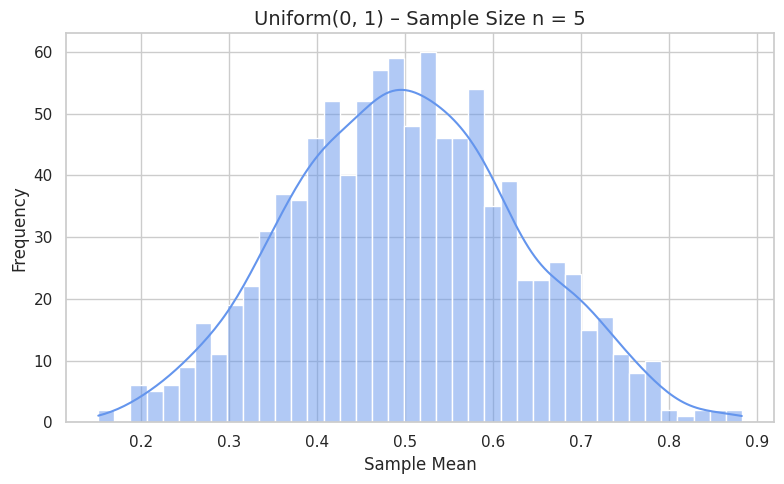
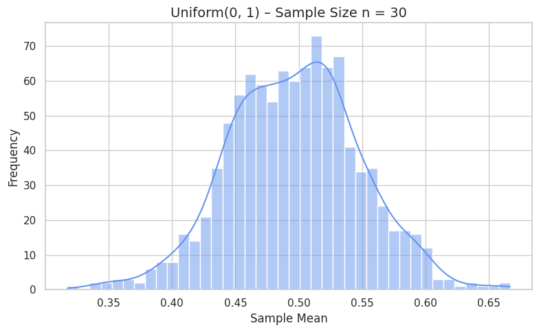
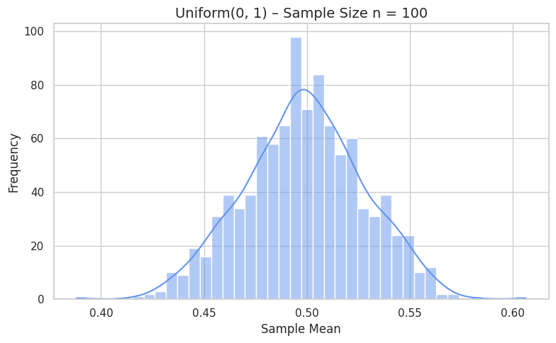
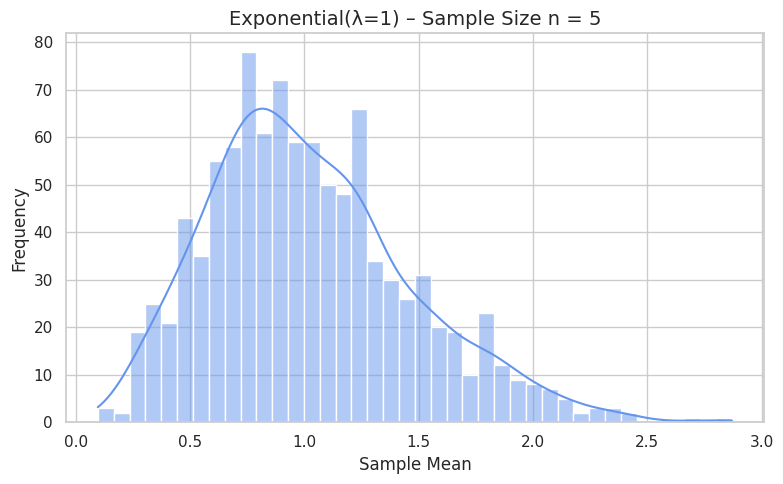
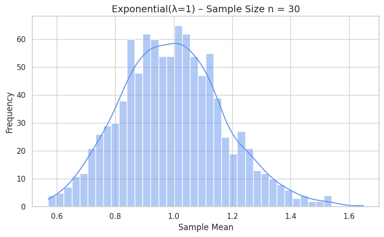
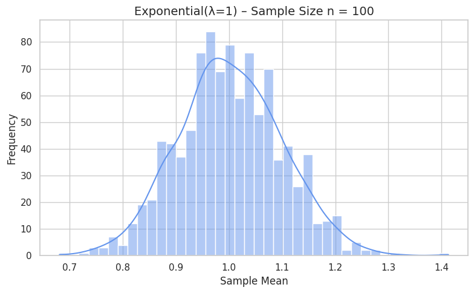
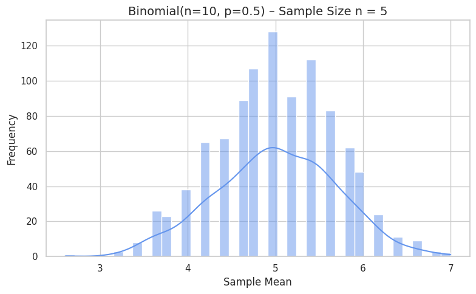
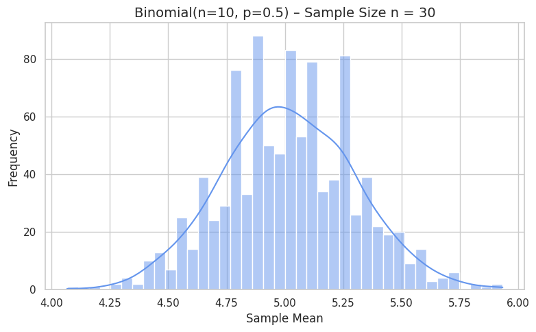
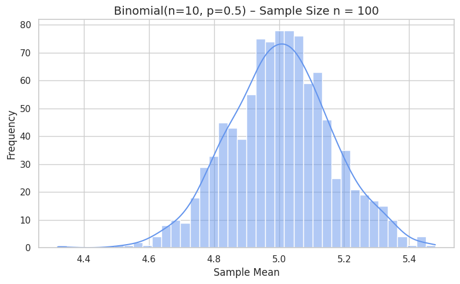

## Introduction to the Central Limit Theorem (CLT)

The Central Limit Theorem (CLT) is one of the most important results in statistics and probability theory. It provides a powerful and surprising insight: even if the population we are sampling from is not normally distributed, the distribution of the sample means will **tend toward a normal distribution** as the sample size increases.

This idea is the foundation for many statistical procedures, including confidence intervals, hypothesis testing, and control charts in quality control.

### Statement of the Theorem:

Let $X_1, X_2, \dots, X_n$ be a random sample of size $n$ drawn from any population with:

- Mean: $\mu$  
- Variance: $\sigma^2$  

Then, as the sample size $n$ increases, the distribution of the sample mean $\bar{X}_n$:

- Approaches a **normal distribution**  

- Has a **mean** equal to the population mean:  
  $\mu_{\bar{X}} = \mu$  

- Has a **standard deviation** (called the standard error of the mean):  
  $\sigma_{\bar{X}} = \frac{\sigma}{\sqrt{n}}$  

This approximation improves as $n$ increases, and becomes quite accurate even for moderate sample sizes (e.g., $n \geq 30$), especially when the population is not extremely skewed.

### What Makes the CLT So Important:

- It allows us to **make inferences** about population parameters (like the mean) even if the population’s distribution is unknown or not normal.

- It forms the theoretical justification for using the **normal distribution** in real-world problems, including polling, manufacturing, medical studies, and finance.

- It helps ensure that sampling-based statistical procedures are valid under broad conditions.

### Examples of Application:

- If you take repeated samples of 30 students’ test scores from a very skewed population (e.g., most scores are low), the **distribution of the sample means** will still form a **bell-shaped curve**.

- In manufacturing, if machine errors are measured over multiple runs, their **average error values** across runs will tend toward a normal distribution, making process control possible.

### Conditions for the CLT to Apply:

- The population should have a **finite mean** and **finite variance**.  

- The **sample size** should be reasonably large. While there is no fixed rule, a common guideline is:

  - $n \geq 30$ for arbitrary distributions.  
  - Smaller $n$ may be sufficient if the population is already symmetric or approximately normal.

- The samples should be **independent and identically distributed (i.i.d.)**.

The CLT gives us a powerful bridge between any population distribution and the normal distribution. It explains why the **normal distribution appears so frequently** in statistics and nature, even when the underlying data is far from normal. Understanding and observing the CLT is essential for interpreting sampling results and using statistical tools correctly.

---

## Simulating Sampling Distributions

To explore the Central Limit Theorem (CLT) in practice, we simulate sampling from several types of population distributions. By observing how the distribution of sample means evolves, we can directly witness how the CLT causes the sampling distribution to approach normality.

### 1. Choosing Population Distributions:

To test the generality of the CLT, we choose **diverse distributions** with different shapes:

- **Uniform distribution**:  
  A flat, symmetric distribution with equal probability across a range.  
  Example: $\text{Uniform}(0, 1)$

- **Exponential distribution**:  
  A skewed, right-tailed distribution often used to model waiting times.  
  Example: $\text{Exponential}(\lambda = 1)$

- **Binomial distribution**:  
  A discrete distribution modeling the number of successes in a fixed number of trials.  
  Example: $\text{Binomial}(n=10, p=0.5)$

Each of these distributions has a **non-normal shape**, which makes them ideal for demonstrating how the CLT works even when the original data isn't normally distributed.

## Sampling and Visualization

In this part of the assignment, I tested how the sampling distribution of the sample mean changes with increasing sample size, using three different population distributions: uniform, exponential, and binomial.

### Sampling Procedure:

- For each population distribution, I selected the following sample sizes:  
  - $n = 5$  
  - $n = 30$  
  - $n = 100$

- For each sample size, I:  
  - Drew 1000 independent random samples with replacement from the population.  
  - Calculated the **sample mean** of each sample.  
  - Collected these means to form a **sampling distribution**.

- I then visualized each set of sample means using histograms with KDE overlays to observe the overall shape.

### What I Observed:

- **Uniform Distribution**:  
  - Even at $n = 5$, the sampling distribution was fairly symmetric.  
  - At $n = 30$ and $n = 100$, it became very smooth and bell-shaped.  
  - The mean was centered around $0.5$, as expected from a Uniform(0, 1) distribution.

- **Exponential Distribution**:  
  - With $n = 5$, the sampling distribution was still skewed to the right, like the original data.  
  - At $n = 30$, the skew started to reduce, and the shape became more balanced.  
  - By $n = 100$, the sampling distribution looked close to normal.  
  - This showed that even skewed distributions normalize with large enough $n$.

- **Binomial Distribution**:  
  - The binomial population was already somewhat symmetric.  
  - At $n = 5$, the distribution of sample means showed visible discreteness, but a peak near 5.  
  - For $n = 30$ and $n = 100$, the shape became nearly perfectly normal.  
  - The average sample mean remained close to the theoretical value of $np = 5$.

### Conclusion:

- In all three cases, increasing the sample size made the sampling distributions smoother, more symmetric, and more bell-shaped.

- The variance of the sample means decreased as $n$ increased, matching the formula:  
  $\sigma_{\bar{X}} = \frac{\sigma}{\sqrt{n}}$

- The results clearly illustrated the Central Limit Theorem in action: regardless of how the original data is shaped, the **distribution of the sample mean approaches normality** as the sample size grows.

## Parameter Exploration

In this part of the project, I explored how both the **shape of the original distribution** and the **sample size** affect the convergence of the sampling distribution toward normality. I also looked at how the **variance** of the population impacts the spread of the sample means.

### Effect of the Original Distribution Shape:

- The rate at which the sampling distribution of the mean approaches a normal shape is closely related to the **skewness and symmetry** of the original population.

- For the **uniform distribution**, which is already symmetric, the convergence was fast. Even with a small sample size like $n = 5$, the sampling distribution looked relatively balanced.

- For the **exponential distribution**, which is heavily skewed, the convergence was much slower. At $n = 5$, the sample means still showed noticeable skewness. Only at $n = 100$ did the distribution become reasonably symmetric.

- The **binomial distribution**, being discrete but fairly symmetric with $p = 0.5$, showed smooth convergence and produced near-normal sampling distributions by $n = 30$.

This shows that the CLT holds in all cases, but **skewed and discrete distributions take longer to converge** to normality.

### Effect of Sample Size:

- As the sample size increased from $n = 5$ to $n = 100$, all sampling distributions became:  
  
  - More **centered** around the true population mean  
  - More **symmetrical**  
  - **Less variable**, with tighter clustering around the mean

- The standard deviation of the sampling distribution decreased with increasing $n$, consistent with:  
  $\sigma_{\bar{X}} = \frac{\sigma}{\sqrt{n}}$

- Larger $n$ values **smooth out irregularities** caused by skewness or discreteness in the population.

### Effect of Population Variance:

- The **spread of the sample means** (i.e., how wide the histogram was) depended not only on $n$ but also on the variance of the original distribution.

- The exponential distribution, which has a higher variance than the uniform or binomial cases, produced sampling distributions that were visibly **wider** for the same sample size.

- As expected, the formula for standard error explains this behavior:
  
  - A larger population variance $\sigma^2$ results in a **larger standard error** unless compensated for by a large $n$.

### Summary:

- Populations with **low skew and low variance** converge more quickly to a normal distribution when sampling.

- Skewed or high-variance populations require **larger sample sizes** to achieve a similar level of normality in their sampling distributions.

- This exploration highlighted how the Central Limit Theorem is robust, but the **rate of convergence depends on both sample size and population characteristics**.

## Practical Applications

Throughout this project, I observed how the Central Limit Theorem (CLT) plays out in simulated data. While the theory is powerful, its true importance lies in the fact that it enables many real-world applications. From business and manufacturing to medicine and finance, the CLT underpins the way we make reliable conclusions based on sample data.

The value of the CLT comes from a simple but powerful idea: no matter what the population looks like, the **distribution of sample means will tend to be normal**, provided the sample size is large enough. This makes it possible to apply techniques based on the normal distribution in a wide range of situations, even when the data itself is far from normal.

### Estimating Population Parameters:

- In real-world data collection, it's rarely feasible to observe an entire population. Instead, we rely on **samples** and use the sample mean to estimate the **true population mean**.

- The CLT ensures that the **distribution of the sample mean is normal**, allowing us to calculate probabilities, margins of error, and confidence intervals even if the population distribution is skewed or unknown.

- For example, in **public health**, researchers use a sample of patients to estimate the average effect of a treatment. Thanks to the CLT, they can quantify how confident they are that their results reflect the population.

- Similarly, **pollsters** rely on the CLT when they report public opinion from small sample groups. Without the CLT, estimating national support for a policy or candidate would be unreliable.

### Quality Control in Manufacturing:

- In manufacturing and industrial settings, continuous testing of every item is impractical. Instead, companies use **sampling techniques** to monitor product quality.

- By taking regular samples from the production line and measuring metrics like weight, size, or defect count, engineers track the **mean performance** of batches.

- Thanks to the CLT, the **distribution of these sample means is approximately normal**, making it possible to set **control limits** and detect when a process is drifting out of specification.

- Tools like **control charts** and **Six Sigma** heavily rely on the CLT to ensure that decisions about quality are statistically sound.

### Predicting Outcomes in Financial Models:

- Financial markets are complex and often volatile, with returns that are not normally distributed in the short term.

- However, many financial tools and risk models (such as **portfolio optimization**, **option pricing**, or **Value at Risk (VaR)**) are based on assumptions that **aggregated or averaged outcomes follow a normal distribution**.

- The CLT provides the justification for this: when analyzing average returns over time or across assets, the sampling distribution of those averages tends to become normal.

- This is crucial for **risk assessment**, where institutions must estimate potential losses and allocate capital accordingly — often under time pressure and uncertainty.

### Scientific Research and Experimentation:

- In experimental sciences, it's common to repeat measurements under slightly different conditions or with different subjects.

- The **sample mean** of repeated trials becomes the key quantity of interest, and the CLT allows researchers to treat that mean as a normally distributed variable.

- This is essential for **hypothesis testing**, where the assumption of normality underlies calculations for p-values and test statistics.

- Without the CLT, the use of standard statistical tests (like t-tests and ANOVA) would not be valid for many real-world datasets.

### Summary:

The Central Limit Theorem is more than just a mathematical curiosity — it’s a **core pillar of applied statistics**. It enables us to:

- Draw conclusions about populations using small samples  
- Quantify uncertainty with confidence intervals  
- Apply normal-distribution tools to non-normal data  
- Make data-driven decisions in fields like health, economics, manufacturing, and engineering

This project made it clear how and why the CLT works, but more importantly, it showed how **statistical theory supports real decisions** in the world around us.
