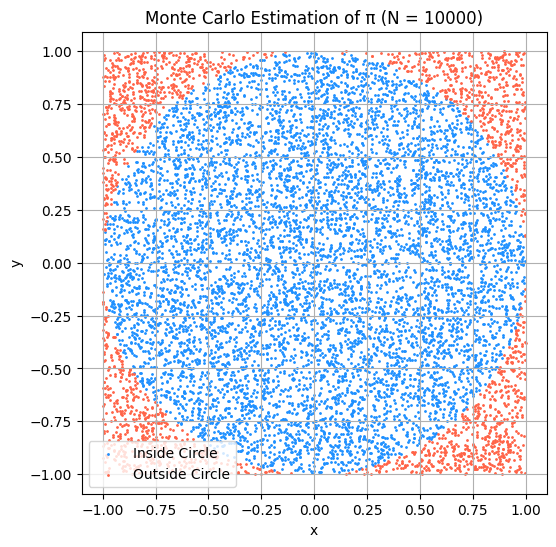
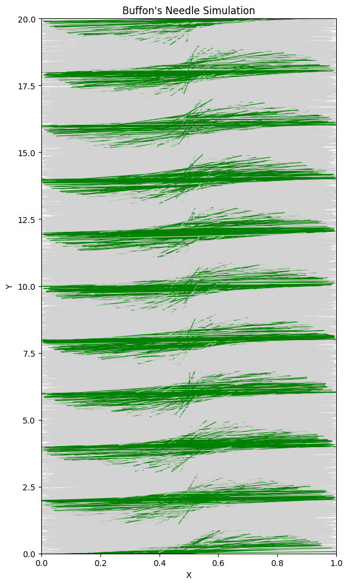

# Estimating π using Monte Carlo Methods

## Estimating π Using a Circle

### Theoretical Foundation

To estimate the value of π using a Monte Carlo method, we use the relationship between the area of a circle and the area of the square that bounds it.

Consider a unit circle (radius $r = 1$) inscribed in a square with side length 2. The circle is centered at the origin, and the square spans from $-1$ to $1$ along both the x and y axes.

- The **area of the circle** is: 

  $A_{\text{circle}} = π \cdot r^2 = π$


- The **area of the square** is:  

  $A_{\text{square}} = (2 \cdot r)^2 = 4$

If we randomly generate a large number of points uniformly distributed across the square, the **ratio of points that fall inside the circle to the total number of points** will approximate the ratio of their areas:

$$
\frac{\text{points inside circle}}{\text{total points}} \approx \frac{A_{\text{circle}}}{A_{\text{square}}} = \frac{π}{4}
$$

Rearranging this gives the formula for estimating π:

$$
π \approx 4 \cdot \left(\frac{\text{points inside the circle}}{\text{total points}}\right)
$$

This approach works because, as the number of points increases, the distribution of points becomes more uniform, and the estimate converges toward the true value of π.

---

### Simulation

To estimate π using this method, I simulated the process by generating random points inside a square and checking whether each point falls inside the inscribed unit circle.

Here’s how the simulation works:

- Generate $N$ random points $(x, y)$ where both $x$ and $y$ are uniformly distributed between $-1$ and $1$.

- For each point, check whether it lies inside the unit circle using the inequality:  
  $x^2 + y^2 \leq 1$


- Count how many points satisfy this condition.

- Estimate π using the formula:


  $π \approx 4 \cdot \left(\frac{\text{points inside circle}}{\text{total points}}\right)$

Our code will look like this :

```
# Monte Carlo simulation to estimate π using the circle method

import numpy as np

# Parameters
N = 10000  # number of random points

# Generate N random points (x, y) in the square [-1, 1] x [-1, 1]
x = np.random.uniform(-1, 1, N)
y = np.random.uniform(-1, 1, N)

# Calculate distance from origin (0,0)
dist_squared = x**2 + y**2

# Count how many points fall inside the unit circle
inside_circle = dist_squared <= 1
num_inside = np.sum(inside_circle)

# Estimate π
pi_estimate = 4 * num_inside / N

print(f"Estimated π (N={N}): {pi_estimate}")

```

In the end we get this final result : **Estimated π (N=10000): 3.1288**

### Visualization

To better understand how the Monte Carlo method approximates π, I created a plot showing all the randomly generated points:

- Points that fall **inside the unit circle** are colored in blue.
- Points that fall **outside the circle** are colored in red.

This visualization clearly shows how the density of points inside the circle compares to those outside, and helps illustrate the geometric basis of the estimation method.



### Analysis

To understand how the accuracy of the Monte Carlo estimate improves, I tested the simulation using different values of $N$ — the total number of randomly generated points.

I used the following sample sizes:

- $N = 100$  
- $N = 1,000$  
- $N = 10,000$  
- $N = 100,000$

For each run, I estimated the value of π and calculated the **absolute error** from the true value $π \approx 3.14159$.

### Observations:

- At small values of $N$ (e.g., $N = 100$), the estimate fluctuated significantly and often deviated from the true value by a noticeable margin.

- As $N$ increased, the estimate **became more stable** and **closer to π**, consistent with the Law of Large Numbers.

- The error appeared to **shrink roughly proportionally to $1 / \sqrt{N}$**, which is a common convergence rate for Monte Carlo methods.

- This method is **probabilistic**, so results can vary slightly with each run, but the overall trend is consistent:  
  more points → more accurate estimate.

### Convergence Rate:

- The convergence of this method is relatively **slow** compared to deterministic numerical methods.

- To gain one additional digit of precision, the sample size must increase by a factor of about **100**.

- This is because the **standard deviation of the estimator** decreases as:  
  $\text{Error} \propto \frac{1}{\sqrt{N}}$

- This slow rate is a well-known trade-off in Monte Carlo simulations.

### Computational Considerations:

- Despite the slow convergence, this method has advantages: 

  - It is **conceptually simple**  

  - It works in **higher dimensions** where other methods fail  

  - It is **highly parallelizable**, making it suitable for large-scale computation


- On the downside, achieving **high precision** requires **a large number of samples**, which increases computational cost.


The Monte Carlo circle method is a powerful but noisy estimator for π. It shows clear convergence toward the true value, but it requires a **very large number of points** to achieve **high accuracy**. The method is best suited for educational purposes, exploratory simulations, or applications where simplicity and parallelism are more important than rapid convergence.


## Estimating π Using Buffon’s Needle

### Theoretical Foundation

Buffon’s Needle is a famous probability problem introduced in the 18th century by Georges-Louis Leclerc, Comte de Buffon. It provides a surprising way to estimate the value of π using random needle drops on a lined surface.

#### Setup:

- We have a floor with **equally spaced parallel lines**, a distance $d$ apart.

- We drop a **needle of length $l$** onto the floor.

- We assume the following conditions:  

  - The needle length $l$ is **less than or equal to** the distance between the lines ($l \leq d$).  
  - The needle falls in a completely **random position and angle**.


#### Goal:

Estimate the probability $P$ that the needle **crosses a line** when it lands.

Buffon showed that the probability of a crossing is given by:

$$
P = \frac{2l}{dπ}
$$

If we rearrange this formula, we can solve for π:

$$
π \approx \frac{2l \cdot N}{d \cdot H}
$$

Where:

- $N$ = total number of needle drops  
- $H$ = number of times the needle crosses a line  

This gives us a way to estimate π based on how often the needle intersects a line. As $N$ increases, the estimate becomes more accurate.

#### Why it works:

- The result is derived from integrating over all possible positions and angles that a randomly dropped needle can take.

- Even though the setup is physical and geometric, it leads to a surprisingly elegant formula involving π.

This method is more abstract and mathematically rich than the circle method, but it also has practical value in understanding randomness, integration, and geometric probability.


### Simulation

To simulate Buffon’s Needle, I modeled the process of randomly dropping a needle on a lined surface and checking whether it crosses a line. The following parameters were used:

- Needle length $l = 1$  
- Distance between lines $d = 2$  
- Total number of needle drops: $N$ (e.g., 10000)

Each needle drop was defined by two random variables:

- The **distance** from the needle’s center to the closest line (uniform between $0$ and $d/2$)

- The **angle** between the needle and the parallel lines (uniform between $0$ and $π/2$)

A needle is considered to **cross a line** if:

$$
\text{distance to nearest line} \leq \frac{l}{2} \cdot \sin(θ)
$$

Using this rule, I counted the number of crossing events and applied the formula:

$$
π \approx \frac{2l \cdot N}{d \cdot H}
$$

Where $H$ is the number of hits (crossings).

```
# Simulation of Buffon's Needle to estimate π

import numpy as np

# Parameters
N = 10000        # number of needle drops
l = 1.0          # length of the needle
d = 2.0          # distance between parallel lines

# Random angle between 0 and π/2
theta = np.random.uniform(0, np.pi / 2, N)

# Distance from center of needle to nearest line (0 to d/2)
y_center = np.random.uniform(0, d / 2, N)

# A needle crosses a line if the vertical reach exceeds the center offset
crossings = y_center <= (l / 2) * np.sin(theta)
num_hits = np.sum(crossings)

# Estimate π using Buffon's formula
if num_hits > 0:
    pi_estimate = (2 * l * N) / (d * num_hits)
    print(f"Estimated π using Buffon's Needle (N = {N}): {pi_estimate}")
else:
    print("No crossings occurred — cannot estimate π")

```
Result will look like this : **Estimated π using Buffon's Needle (N = 10000): 3.117206982543641**
### Visualization

To better understand the simulation, I created a 2D plot showing the outcome of each needle drop:

- Each needle is drawn as a line segment.
- **Needles that cross a line** are shown in green.
- **Needles that do not cross a line** are shown in gray.
- The parallel floor lines are shown as horizontal dashed lines.

This visualization helps illustrate the geometric nature of the problem and confirms that the randomness is correctly distributed across angle and position.



This plot gives a clear visual sense of how the simulation works — green lines indicate successful crossings that contribute to the π estimate.

### Analysis

After running simulations with different numbers of needle drops, I explored how the accuracy of the estimate for π changed and how this method compared to the circle-based approach in terms of convergence.

### Accuracy with Increasing Drops:

I tested the Buffon’s Needle method with different values of $N$, such as:

- $N = 1,000$
- $N = 10,000$
- $N = 100,000$

The estimated value of π **fluctuated significantly** when the number of drops was low. For example:

- At $N = 1,000$, results varied between 2.8 and 3.4 depending on the random seed and distribution of angles.
- At $N = 100,000$, the result was much more stable and closer to the true value of π (approximately 3.1416).

This behavior is expected due to the **inherent randomness** and relatively low probability of a crossing event, which introduces high variance in small samples.

### Convergence Rate and Comparison:

- Both the **circle method** and **Buffon’s Needle method** rely on Monte Carlo techniques, and their **convergence rate** is theoretically similar:  
  $\text{Error} \propto \frac{1}{\sqrt{N}}$

- However, in practice, Buffon’s method converges **much more slowly** than the circle method. Reasons include:

  - The crossing condition in Buffon’s method is more sensitive to small angle values.
  
  - The number of crossing events is relatively **low compared to total drops**, especially when the needle is short relative to the line spacing.

  - As a result, the **variance of the estimator** is much higher, which leads to less stable estimates of π unless $N$ is extremely large.


- The circle method, by contrast, has a much **higher signal-to-noise ratio**: every point contributes clearly to the estimate, and the proportion inside the circle is relatively large and stable.

### Summary:

- Buffon’s Needle method can estimate π, but it requires a **very large number of drops** to achieve accuracy comparable to the circle method.

- It is **mathematically elegant** and historically important, but less efficient as a practical estimation technique.

- Compared to the circle-based approach, Buffon’s method is a good demonstration of **geometric probability**, but not ideal for computational estimation of π.
